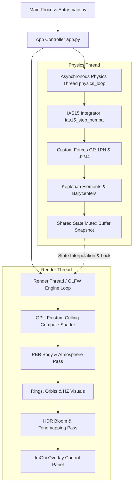

# Stellar-Forge 🌌🪐

[](https://www.python.org/)
[](https://www.opengl.org/)
[](https://numba.pydata.org/)
[](https://naif.jpl.nasa.gov/naif/)
[](LICENSE)

**Stellar-Forge** is a state-of-the-art, interactive N-body gravitational simulation engine and astronomical sandbox built with Python, ModernGL, Numba JIT acceleration, and PyImGui. It provides real-time physics integration, physically based atmospheric raymarching, general relativity orbital precession, higher-order zonal harmonic oblate gravity (J2, J4), and seamless integration with NASA JPL SPICE kernels and Horizons ephemeris data.

---

## 📋 Table of Contents

- [Key Features](#-key-features)
- [Architecture & Design](#-architecture--design)
- [Physics Engine & Astrophysics](#-physics-engine--astrophysics)
  - [IAS15 N-Body Integrator](#ias15-n-body-integrator)
  - [Relativistic & Oblate Gravity](#relativistic--oblate-gravity)
  - [Keplerian Dynamics & Hierarchy](#keplerian-dynamics--hierarchy)
  - [Stellar Astrophysics & Climate](#stellar-astrophysics--climate)
- [Graphics & Rendering Pipeline](#-graphics--rendering-pipeline)
  - [GPU Frustum Culling](#gpu-frustum-culling)
  - [Physically Based Atmospheric Scattering](#physically-based-atmospheric-scattering)
  - [Planetary Rings & Planetshine](#planetary-rings--planetshine)
  - [HDR Post-Processing Pyramid](#hdr-post-processing-pyramid)
- [Project Structure](#-project-structure)
- [Installation & Setup](#-installation--setup)
- [Usage & Controls](#-usage--controls)
- [Ephemeris & Data Scripts](#-ephemeris--data-scripts)
- [License](#-license)

---

## ✨ Key Features

- **🚀 High-Performance N-Body Integrator**: Implements the **IAS15** (15th-order adaptive step-size integrator by Rein & Spiegel), compiled to machine code via Numba (`@njit(nogil=True)`), enabling ultra-fast simulations outside Python's Global Interpreter Lock (GIL).
- **🌌 General Relativity & Zonal Harmonics**: Accurately simulates 1PN (post-Newtonian) Schwarzschild relativistic precession around compact objects and J2/J4 oblate gravitational harmonics for fast-rotating giant stars and planets.
- **☀️ Stellar Classification & Evolution**: Computes effective temperatures, spectral classes (O, B, A, F, G, K, M, L, T, Y), luminosity classes (Hypergiants to Subdwarfs), and dynamic Habitable Zone (HZ) boundaries based on stellar parameters.
- **🌤️ Physically Based Atmospheric Scattering**: Multi-pass sky raymarching powered by precomputed Look-Up Tables (LUTs) for transmittance, single scattering, and multi-scattering across customizable planetary gas compositions.
- **🛰️ NASA JPL SPICE & Horizons Integration**: Real-time position playback using official NAIF SPICE kernels (`.bsp`, `.tpc`, `.tls`) and automatic REST querying of JPL Horizons state vectors.
- **🪐 Dynamic Planetshine & Rings**: Multi-plane planetary ring rendering with coplanar shadowing and Numba-accelerated planetshine illumination.
- **🎥 HDR Post-Processing Pipeline**: ModernGL multi-pass post-processing with Bloom downsample/upsample pyramids, exposure controls, and ACES / Reinhard tone mapping.
- **🎮 Interactive Control Panel & Editor**: Full PyImGui user interface featuring timeline scrubbers, body addition wizards, system comparison tools, visual customization, and persistent configuration settings.

---

## 🏗️ Architecture & Design

Stellar-Forge is architected with a decoupled, asynchronous multi-threaded pipeline separating high-rate physics calculations from smooth user rendering.



---

## 🔬 Physics Engine & Astrophysics

### IAS15 N-Body Integrator

The core physics integration uses **IAS15**, a 15th-order Gauss-Radau predictor-corrector integrator capable of adaptive step size control down to machine precision.

\[
x(t) = x_0 + v_0 t + \int_0^t \int_0^{\tau} a(t') \, dt' \, d\tau
\]

It evaluates accelerations at specific Gauss-Radau nodes, adapting step sizes based on local truncation error estimates:
\[
\Delta t_{\text{new}} = \Delta t \cdot \left( \frac{\epsilon}{\text{error}} \right)^{1/7}
\]

### Relativistic & Oblate Gravity

1. **General Relativity (1PN Post-Newtonian Correction)**:
   Accounts for perihelion precession near massive objects:
   \[
   \mathbf{a}_{\text{GR}} = \frac{G M}{c^2 r^3} \left( \left[ 4 \frac{G M}{r} - v^2 \right] \mathbf{r} + 4 (\mathbf{r} \cdot \mathbf{v}) \mathbf{v} \right)
   \]

2. **Oblate Harmonics ($J_2$ and $J_4$)**:
   Modifications to gravitational potential due to oblateness:
   \[
   V(r, \theta) = -\frac{GM}{r} \left[ 1 - \sum_{n=2}^4 J_n \left( \frac{R_{eq}}{r} \right)^n P_n(\cos\theta) \right]
   \]

### Keplerian Dynamics & Hierarchy

The system automatically extracts osculating orbital elements (Semi-major axis $a$, Eccentricity $e$, Inclination $i$, Longitude of Ascending Node $\Omega$, Argument of Periapsis $\omega$, True Anomaly $\nu$) for all bodies relative to their local gravitational barycenters.

### Stellar Astrophysics & Climate

- **Stellar Radiation**: Computes stellar luminosity via Stefan-Boltzmann law $L = 4\pi R^2 \sigma T_{\text{eff}}^4$.
- **Surface Equilibrium Temperature**: Dynamic thermal balance model including distance, planetary albedo $A$, and greenhouse multiplier $\gamma$:
  \[
  T_{\text{eq}} = \left( \frac{L (1 - A)}{16 \pi \sigma d^2} \right)^{1/4} (1 + \gamma)
  \]
- **Habitable Zone (HZ)**: Visualizes Conservative (Runaway Greenhouse to Maximum Greenhouse) and Optimistic HZ limits around host stars.

---

## 🎨 Graphics & Rendering Pipeline

### GPU Frustum Culling
A GLSL Compute Shader computes bounding sphere visibility against camera frustum planes before draw calls, updating instance buffers to minimize draw call overhead and GPU workload.

### Physically Based Atmospheric Scattering
Utilizes a multi-step precomputation technique inspired by Bruneton e.a.:
1. **Transmittance LUT**: Precomputes optical depth for Rayleigh and Mie scattering across altitudes and zenith angles.
2. **Multi-Scattering LUT**: Approximates higher-order light bounces inside the atmosphere.
3. **Real-Time Raymarching Shader**: Combines Rayleigh scattering (sky blue color), Mie scattering (sun halos), and ozone absorption in real time.

### Planetary Rings & Planetshine
- **Planetary Rings**: Rendered with dynamic optical depth, phase functions, and self-shadowing cast by the parent planet and companion bodies.
- **Planetshine**: Secondary diffuse light bounced from illuminated planetary disks onto nearby moons, accelerated via Numba.

### HDR Post-Processing Pyramid
1. **Bright Pass Filtering**: Isolates high-intensity pixels above threshold.
2. **Downsample / Upsample Pyramid**: Progressive Gaussian blurring across 5 MIP levels for smooth lens flare blooming.
3. **Tone Mapping**: Configurable ACES Film or Reinhard tone mapping operators converting HDR colors to sRGB monitors with dynamic exposure adjustment.

---

## 📁 Project Structure

```
Stellar-Forge/
├── engine/                      # Core engine python modules
│   ├── app.py                   # Main window, rendering loops, ImGui UI & event handling
│   ├── main.py                  # Entry point script with fault handling and crash loggers
│   ├── physics_core.py          # Numba-compiled IAS15 integrator, custom forces & physics loop
│   ├── system_manager.py        # System I/O, state snapshots, stellar property derivation
│   ├── spice_manager.py         # NAIF SPICE kernel manager, automated kernel downloader
│   ├── star_calc.py             # Stellar classification, HR diagram statistics & HZ bounds
│   ├── shaders.py               # GLSL shader strings for celestial bodies, atmospheres & LUTs
│   ├── post_shaders.py          # GLSL post-processing shaders (Bloom, HDR Tone Mapping)
│   ├── render_utils.py          # ModernGL buffer handlers & UV sphere mesh generators
│   ├── math_utils.py            # Fast vector operations & Kepler equation solvers
│   └── constants.py             # Physical, astronomical constants & conversion ratios
├── data/                        # Simulation data & system presets
│   ├── systems/                 # System JSON profiles (Solar System, Achernar, etc.)
│   ├── kernels/                 # Storage directory for downloaded NAIF SPICE kernels
│   ├── system.json              # Active default planetary system data
│   └── ephemeris_settings.json  # Configuration for SPICE playback dates & active kernels
├── scripts/                     # Utility and benchmark scripts
│   ├── fetch_horizons.py        # Fetch J2000 state vectors directly from JPL Horizons REST API
│   ├── perf_test.py             # Benchmark engine startup and frame performance
│   └── accuracy_test.py         # Physics solver validation and energy conservation tests
├── run.bat                      # Quick launch batch script for Windows
├── imgui.ini                    # Saved ImGui window positions and layout configurations
├── .gitignore                   # Git exclusion patterns
└── README.md                    # Project documentation
```

---

## 📦 Installation & Setup

### Prerequisites

- **Python 3.10+** (64-bit recommended)
- **Dedicated GPU** supporting OpenGL 4.3+ (for Compute Shaders and SSBOs)

### 1. Clone the Repository
```bash
git clone https://github.com/YourUsername/Stellar-Forge.git
cd Stellar-Forge
```

### 2. Create and Activate Virtual Environment (Recommended)
```bash
python -m venv venv
# On Windows:
venv\Scripts\activate
# On Linux/macOS:
source venv/bin/activate
```

### 3. Install Dependencies
```bash
pip install numpy moderngl glfw pyrr imgui numba spiceypy requests
```

---

## 🚀 Usage & Controls

### Launching the Engine

- **Windows Batch Script**: Double-click `run.bat` or run in command prompt:
  ```cmd
  run.bat
  ```
- **Manual Launch**:
  ```bash
  python engine/main.py
  ```

### Key Controls & Navigation

| Action | Control |
| :--- | :--- |
| **Rotate Camera** | Right-Click + Drag |
| **Pan Camera** | Middle-Click + Drag |
| **Zoom** | Mouse Scroll Wheel |
| **Focus Object** | Double-Click on body or select in Control Panel |
| **Time Controls** | Play/Pause, Logarithmic Speed Slider in UI |
| **Graphics Modal** | Accessible from top menu bar or Control Panel |

---

## 📡 Ephemeris & Data Scripts

### Querying JPL Horizons
To update system initial states with live NASA JPL Horizons ephemerides:
```bash
python scripts/fetch_horizons.py
```

### NAIF SPICE Kernels
The engine automatically downloads essential kernels (`de440s.bsp`, `pck00010.tpc`, `naif0012.tls`) into `data/kernels/` when switching to Ephemeris Mode via the UI. Additional planetary satellite kernels can be downloaded directly through the in-app **Ephemeris Setup** modal.

---

## 📜 License

Distributed under the MIT License. See `LICENSE` for more information.
