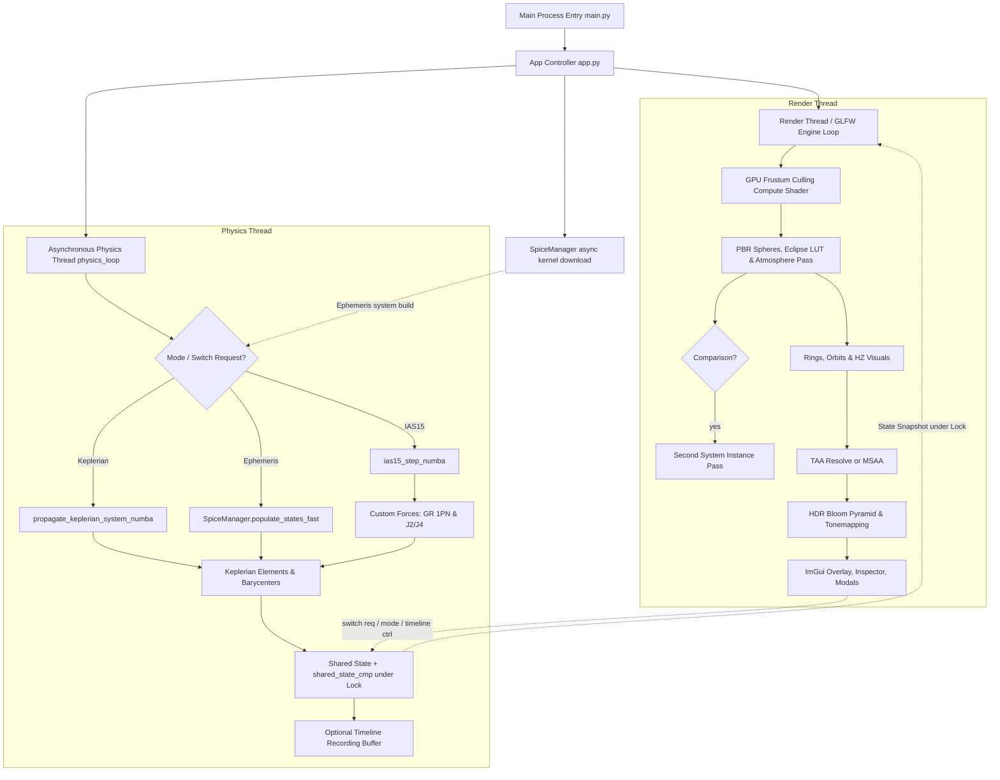

# Stellar-Forge 🌌🪐

[](https://www.python.org/)
[](https://www.opengl.org/)
[](https://numba.pydata.org/)
[](https://naif.jpl.nasa.gov/naif/)
[](LICENSE)

**Stellar-Forge** is a state-of-the-art, interactive N-body gravitational simulation engine and astronomical sandbox built with Python, ModernGL (OpenGL 4.6), Numba JIT acceleration, and PyImGui. It ships with **three switchable simulation modes** — a 15th-order **IAS15** N-body integrator, an **analytical Keplerian** propagator, and live **NASA SPICE ephemeris playback** — and provides physically based atmospheric raymarching, general relativity orbital precession, higher-order zonal harmonic oblate gravity ($J_2, J_4$), eclipse shadow lookup tables (supporting oblate star geometry), temporal anti-aliasing (TAA) and HDR bloom post-processing, a comprehensive body inspector, side-by-side **system comparison**, **timeline recording & scrubbing**, an in-app **system / body editor**, and seamless integration with NASA JPL SPICE kernels and Horizons ephemeris data.

---

## 🚀 Quick Start / How to Run

### 1. Prerequisites & Dependencies
Ensure you have **Python 3.10+** (64-bit) and a dedicated GPU supporting OpenGL 4.3+.

```bash
# Clone the repository
git clone https://github.com/YourUsername/Stellar-Forge.git
cd Stellar-Forge

# (Optional) Create and activate virtual environment
python -m venv venv
# On Windows:
venv\Scripts\activate
# On Linux/macOS:
source venv/bin/activate

# Install required python packages
pip install numpy scipy moderngl glfw pyrr imgui numba spiceypy requests PyOpenGL Pillow
```

### 2. Launching the Simulation Engine
- **Windows One-Click Launch**: Double-click `run.bat` or execute in terminal. This launcher automatically creates/verifies the virtual environment and installs any missing dependencies on startup:
  ```cmd
  run.bat
  ```
- **Standard Terminal Launch**:
  ```bash
  python engine/main.py
  ```

### 3. Keyboard & Mouse Controls

#### 🖱️ Mouse Navigation
* **Left Mouse Button (Drag)**: Pivot the camera in place (free look).
* **Left Mouse Button (Click)**: Select / pick a celestial body in the viewport.
* **Right Mouse Button (Drag)**: Orbit the camera around the tracked body (keeps distance).
* **Left + Right Mouse Button (Drag)**: Approach / recede from the tracked body's surface (drag down = move closer, up = pull back).
* **Scroll Wheel**: Change flight velocity (~2× per notch, capped at 5 AU/s).
* **Shift + Scroll Wheel**: Adjust Field of View (FOV) ($1.0^\circ - 120.0^\circ$).

#### ⌨️ Keyboard Commands
* **W / S / A / D (hold)**: Fly forward / backward / strafe in flight mode; walk along the surface when landed.
* **Space**: Pause / resume simulation time.
* **Up / Right Arrow**: Double the simulation speed (time multiplier, capped at $10^{12}\times$).
* **Down / Left Arrow**: Halve the simulation speed (minimum $1.0\times$).
* **R**: Reset simulation time multiplier to $1.0\times$.
* **Q / E (hold)**: Roll / tilt the camera counter-clockwise / clockwise.
* **Minus (`-`) / Equal (`=`)**: Decrease / increase camera exposure.
* **Shift + Minus (`-`) / Equal (`=`)**: Double-speed decrease / increase of camera exposure.
* **Backslash (`\`) + Click "Export"**: Developer shortcut (only valid when active system is `Solar System`) that updates and dumps all bodies' cosmetics directly into the master `data/system.json`. (Standard **Click "Export"** without `\` saves a single body's cosmetic properties to a JSON file under `exports/`, while custom systems save changes directly).

---

## 📋 Table of Contents

- [Quick Start / How to Run](#-quick-start--how-to-run)
  - [Keyboard & Mouse Controls](#3-keyboard--mouse-controls)
- [Key Features](#-key-features)
- [Physics Engine & Accuracy Testing](#-physics-engine--accuracy-testing)
  - [IAS15 N-Body Integrator](#ias15-n-body-integrator)
  - [Analytical Keplerian Propagation](#analytical-keplerian-propagation)
  - [Relativistic & Oblate Gravity](#relativistic--oblate-gravity)
  - [JPL Horizons Benchmark Results](#jpl-horizons-benchmark-results)
- [Graphics & Rendering Pipeline](#-graphics--rendering-pipeline)
  - [Eclipse Shadows & Oblate Star Support](#eclipse-shadows--oblate-star-support)
  - [Physically Based Atmospheric Scattering](#physically-based-atmospheric-scattering)
  - [Planetary Rings, Planetshine & Ringshine](#planetary-rings-planetshine--ringshine)
  - [HDR, Bloom & Temporal Anti-Aliasing](#hdr-bloom--temporal-anti-aliasing)
- [Simulation Modes](#-simulation-modes)
- [Comprehensive Inspector & Controls](#-comprehensive-inspector--controls)
  - [System Comparison & Timeline](#system-comparison--timeline)
  - [System & Body Editor](#system--body-editor)
- [Architecture & Design](#-architecture--design)
- [Project Structure](#-project-structure)
- [Project Map for Contributors / LLMs](#-project-map-for-contributors--llms)
- [Ephemeris & Data Scripts](#-ephemeris--data-scripts)
- [License](#-license)

---

## ✨ Key Features

- **🚀 High-Performance N-Body Integrator**: Implements the **IAS15** (15th-order adaptive step-size integrator by Rein & Spiegel), compiled to machine code via Numba (`@njit(nogil=True)`), enabling ultra-fast simulations outside Python's Global Interpreter Lock (GIL).
- **🪐 Analytical Keplerian Propagation**: $\mathcal{O}(N)$ hierarchical propagation mode utilizing Jacobi coordinates and top-down subsystem barycentric placement to completely eliminate circular dependencies and barycentric wobble. Includes $J_2$, GR, and third-body vector precession.
- **🌌 General Relativity & Zonal Harmonics**: Accurately simulates 1PN (post-Newtonian) Schwarzschild relativistic precession around compact objects and $J_2 / J_4$ oblate gravitational harmonics for fast-rotating giant stars and planets.
- **🌑 Eclipse Shadows & Oblate Star Geometry**: Precomputed eclipse Look-Up Tables (LUTs) casting realistic umbra and penumbra shadows across planet surfaces, atmospheres, and rings, including geometric projection support for oblate stars.
- **🔬 JPL Horizons Accuracy Suite**: Includes automated verification benchmarks (`accuracy_test.py`) that compare 1-year numerical integrations directly against NASA JPL Horizons ground-truth state vectors.
- **🛠️ Comprehensive Body Inspector**: In-depth GUI panel displaying real-time physical properties, osculating Keplerian orbital elements, atmospheric composition, effective thermal equilibrium, spectral type classifications, and dynamic property sliders.
- **☀️ Stellar Classification & Evolution**: Computes effective temperatures, spectral classes (O, B, A, F, G, K, M, L, T, Y), luminosity classes (Hypergiants to Subdwarfs), and dynamic Habitable Zone (HZ) boundaries.
- **🌤️ Atmospheric Raymarching & Lensing Refraction**: Multi-pass sky raymarching powered by precomputed Look-Up Tables (LUTs) for transmittance, single scattering, and multi-scattering across customizable planetary gas compositions. Includes physical Snell's law atmospheric lensing refraction ($\alpha_0 = (n_0 - 1) \sqrt{2\pi R / H}$) that analytically bends primary view rays through celestial body impostors (`sphere.frag`) and atmospheres (`atmo.frag`) at arbitrary distances without clipping.
- **🛰️ NASA JPL SPICE & Horizons Integration**: Real-time position playback using official NAIF SPICE kernels (`.bsp`, `.tpc`, `.tls`) with automatic kernel discovery & threaded downloading, plus REST querying of JPL Horizons state vectors. Ephemeris systems can be **exported to N-body system JSON** for further simulation.
- **⚖️ System Comparison Mode**: Side-by-side rendering of two systems (e.g. IAS15 vs. Keplerian, or two presets) sharing the same camera, with independent time controls and a dedicated comparison inspector.
- **⏯️ Timeline Recording & Scrubbing**: Record a system's full evolution into a position/velocity buffer and scrub or play it back frame-by-frame — useful for replaying close encounters and validating integration stability.
- **🧊 Orbit MSAA**: Orbit lines are rendered into a dedicated multisample buffer (0×/2×/4×/8×) so they stay crisp while the rest of the scene renders at full native resolution without MSAA.
- **🧰 System & Body Editor**: In-app **Create New System** wizard, **Add Orbiting Body** placer, and a per-body **Export** workflow for cosmetics. Custom systems persist edits directly; the Solar System supports a developer `\`+Export shortcut to dump all cosmetics into the master `data/system.json`.

---

## 🔬 Physics Engine & Accuracy Testing

### IAS15 N-Body Integrator

The core physics N-body integration uses **IAS15**, a 15th-order Gauss-Radau predictor-corrector integrator capable of adaptive step size control down to machine precision.

$$
x(t) = x_0 + v_0 t + \int_0^t \int_0^{\tau} a(t') \, dt' \, d\tau
$$

It evaluates accelerations at specific Gauss-Radau nodes, adapting step sizes based on local truncation error estimates:
$$
\Delta t_{\text{new}} = \Delta t \cdot \left( \frac{\epsilon}{\text{error}} \right)^{1/7}
$$

### Analytical Keplerian Propagation

Stellar-Forge includes an alternate **Analytical Keplerian Mode** for $\mathcal{O}(N)$ complexity simulation. Rather than numerically integrating gravitational equations of motion, it computes exact Keplerian orbits within a hierarchical tree.

#### 1. Jacobi Coordinate Decomposition
Standard hierarchical models suffer from "barycentric wobble" when minor bodies orbit massive bodies that themselves orbit a central barycenter. To solve this, Stellar-Forge uses **Jacobi coordinates**:
- The state of each body is calculated relative to the *barycenter of all inner subsystems* orbiting the same parent.
- This decomposes the N-body system into a sequence of decoupled two-body problems with mass-weighted coordinates.

#### 2. Vector Nodal & Apsidal Precession
To prevent orbit lines from remaining static, the analytical engine includes vector-based perturbations that update elements analytically at each time step:
- **Nodal Precession Vector ($\mathbf{\Omega}_{\text{prec}}$)**: Represents orbital plane regression around the parent's spin axis or third-body normal vector. Calculated from $J_2$ oblateness and third-body (grandparent) gravitational influence.
- **Apsidal Precession ($d\omega/dt$)**: Analytical advance of the periapsis inside the orbital plane, caused by $J_2$ zonal harmonics, general relativity (1PN precession), and third-body resonance.

For each body, the orbit normal vector $\mathbf{n}$ and eccentricity vector $\mathbf{e}$ are precessed via axis-angle rotation:
$$
\mathbf{v}_{\text{new}} = \mathbf{v} \cos\theta + (\mathbf{k} \times \mathbf{v}) \sin\theta + \mathbf{k} (\mathbf{k} \cdot \mathbf{v})(1 - \cos\theta)
$$
Where $\mathbf{k}$ is the unit precession axis, and $\theta = \|\mathbf{\Omega}_{\text{prec}}\| \Delta t$.

#### 3. Top-Down Jacobi Placement
During propagation:
1. Mean anomaly is updated: $M(t) = (M_0 + n \cdot \Delta t) \bmod 2\pi$.
2. The eccentric anomaly $E$ is solved via Kepler's Equation: $M = E - e \sin E$.
3. Precessed $\mathbf{n}$ and $\mathbf{e}$ vectors are used to generate the 3D relative position and velocity.
4. Position and velocity are mapped back from Jacobi coordinates to Cartesian coordinates in a top-down pass through the hierarchy tree.

### Relativistic & Oblate Gravity

1. **General Relativity (1PN Post-Newtonian Correction)**:
   Accounts for perihelion precession near massive objects:
   $$
   \mathbf{a}_{\text{GR}} = \frac{G M}{c^2 r^3} \left( \left[ 4 \frac{G M}{r} - v^2 \right] \mathbf{r} + 4 (\mathbf{r} \cdot \mathbf{v}) \mathbf{v} \right)
   $$

2. **Oblate Harmonics ($J_2, J_4$)**:
   Modifications to gravitational potential due to rotational oblateness:
    $$
    V(r, \theta) = -\frac{GM}{r} \left[ 1 - \sum_{n=2}^4 J_n \left( \frac{R_{eq}}{r} \right)^n P_n(\cos\theta) \right]
    $$

### JPL Horizons Benchmark Results

Stellar-Forge includes automated accuracy testing scripts (`accuracy_test.py`) that benchmark the engine's 1-year (365 days) forward integration against official NASA JPL Horizons ground-truth orbital vectors. 

Errors are decomposed into standard astronomical **RTN (Radial, Transverse/Along-Track, Normal/Cross-Track)** coordinate frames in kilometers. Below are the actual benchmark results:

| Body Name | Total Drift (km) | Ahead/Behind (km) | Radial (km) | Cross-Track (km) |
| :--- | :---: | :---: | :---: | :---: |
| **Mercury** | 0.19 km | -0.19 km | -0.02 km | -0.00 km |
| **Venus** | 0.13 km | -0.13 km | 0.01 km | -0.00 km |
| **Earth** | 0.05 km | -0.05 km | -0.00 km | 0.00 km |
| **Moon** | 0.90 km | 0.90 km | -0.01 km | 0.03 km |
| **Mars** | 0.08 km | 0.07 km | -0.03 km | 0.00 km |
| **Jupiter** | 0.07 km | -0.02 km | 0.07 km | 0.00 km |
| **Saturn** | 0.05 km | 0.04 km | 0.01 km | -0.01 km |
| **Uranus** | 88.98 km | -50.56 km | 73.17 km | -2.74 km |
| **Neptune** | 0.08 km | 0.05 km | -0.06 km | -0.01 km |
| **Pluto** | 1.87 km | -1.87 km | 0.07 km | -0.05 km |
| **Ceres** | 0.15 km | 0.09 km | -0.12 km | -0.00 km |
| **Vesta** | 0.20 km | 0.16 km | -0.12 km | 0.00 km |
| **Pallas** | 0.05 km | 0.03 km | -0.03 km | 0.02 km |
| **Haumea** | 0.05 km | -0.04 km | -0.03 km | 0.01 km |
| **Makemake** | 0.03 km | -0.02 km | -0.03 km | 0.00 km |
| **Eris** | 0.04 km | 0.02 km | 0.03 km | -0.02 km |
| **Europa** *(Jovian Moon)* | 15.14 km | 2.41 km | 0.98 km | -14.91 km |
| **Ganymede** *(Jovian Moon)* | 24.72 km | 24.41 km | 0.30 km | -3.88 km |
| **Callisto** *(Jovian Moon)* | 18.00 km | 17.98 km | 0.13 km | 0.65 km |
| **Titan** *(Saturnian Moon)* | 10.25 km | -10.25 km | -0.01 km | -0.01 km |
| **Hyperion** *(Saturnian Moon)* | 9.55 km | -9.51 km | 0.84 km | -0.02 km |
| **Charon** *(Plutonian Moon)* | 17.58 km | -17.58 km | -0.00 km | 0.00 km |
| **Triton** *(Neptunian Moon)* | 18.98 km | -16.89 km | -0.01 km | 8.65 km |

*\*Note: Major planets and dwarf planets achieve sub-kilometer to near-zero positional drift over a full orbital year ($< 0.05 \text{ km}$ for Earth and Eris!). Small close-in moons reflect expected high-frequency tidal and multi-body resonance drift when unmodelled by point-mass dynamics.*

To run the benchmark yourself:
```bash
python scripts/accuracy_test.py
```

---

## 🎨 Graphics & Rendering Pipeline

### Eclipse Shadows & Oblate Star Support
- **Precomputed Eclipse LUT (`u_eclipse_lut`)**: Generates high-precision light attenuation lookup tables bound across spherical planet shaders (`prog_spheres`), rings (`prog_rings`), and atmosphere raymarchers (`prog_atmo`).
- **Oblate Star Geometry**: Corrects light cone and shadow penumbra geometry for fast-rotating, oblate host stars (e.g., Achernar), projecting elliptical stellar disks during eclipses and occultations.

### Physically Based Atmospheric Scattering & Refraction
Utilizes a multi-step precomputation technique inspired by Bruneton e.a.:
1. **Transmittance LUT**: Precomputes optical depth for Rayleigh and Mie scattering across altitudes and zenith angles.
2. **Multi-Scattering LUT**: Approximates higher-order light bounces inside the atmosphere.
3. **Real-Time Raymarching Shader**: Combines Rayleigh scattering (sky color), Mie scattering (sun halos), and gas absorption in real time.
4. **Atmospheric Refraction & Lensing**: Computes closed-form horizontal grazing refraction angles $\alpha_0 = (n_0 - 1) \sqrt{\frac{2\pi R}{H}}$ based on gas composition, surface pressure, and temperature. Primary camera view rays are analytically bent through both planet sphere impostors (`sphere.frag`), atmospheres (`atmo.frag`), and vertex bounding proxies (`atmo.vert`, `sphere.vert`), accurately reproducing astronomical horizon refraction (~34.5') and space-to-space lensing rings (~1.15') without distance cutoffs.

### Planetary Rings, Planetshine & Ringshine
- **Planetary Rings**: Rendered with dynamic optical depth, Phase functions (supporting forward/backward scattering asymmetry), and self-shadowing cast by the parent planet and companion bodies.
- **Planetshine**: Secondary diffuse light bounced from illuminated planetary disks onto nearby satellites and moons. To keep rendering fast, the aggregate bounce light direction and color are precalculated on the CPU using Numba (`compute_planetshine_numba` in [app.py](file:///d:/Files/Coding/OpenGL/Stellar-Forge/engine/app.py)) and passed as instance attributes to the GPU.
- **Ringshine**: Scattered sunlight from planetary ring planes onto the host planet's surface and its orbiting moons. Calculated in real time on the GPU (in the fragment shader of [shaders.py](file:///d:/Files/Coding/OpenGL/Stellar-Forge/engine/shaders.py)):
  - *For the Host Planet*: Evaluated using a macro-approximation based on the ring plane's area, elevation, solid angle, and a noon-fade term.
  - *For Orbiting Moons*: Dynamically projects the closest ring element to the moon, evaluates a wrapped Lambertian light model to mimic the ring plane's broad area-light profile, and calculates soft penumbral shadow softening as the moon enters/leaves the host planet's cylindrical shadow cylinder.

### HDR, Bloom & Orbit MSAA
1. **Bright Pass Filtering**: Isolates high-intensity pixels above a configurable threshold.
2. **Downsample / Upsample Pyramid**: Progressive Gaussian blurring across 5 MIP levels for smooth lens flare blooming, driven by `bloom_downsample_shader_*` / `bloom_upsample_shader_fs`.
3. **Tone Mapping**: Composite pass (`composite_shader_fs`) with ACES Film or Reinhard operators converting HDR colors to sRGB with dynamic exposure adjustment, gated by HDR Mode and bloom intensity/threshold controls.
4. **Orbit MSAA**: The scene renders without MSAA at full native resolution. Orbit lines are drawn into a dedicated MSAA framebuffer (0×/2×/4×/8×), resolved, and blended back over the scene so they stay crisp.

---

## 🧭 Simulation Modes

Stellar-Forge's physics thread (`physics_loop` in `physics_core.py`) supports **three runtime-switchable modes**, selectable from the UI without restarting:

| Mode | Description | Key Kernel |
| :--- | :--- | :--- |
| **IAS15 (N-Body)** | 15th-order adaptive Gauss-Radau integration of full mutual gravity + custom forces (GR 1PN, $J_2/J_4$). Highest fidelity, cost scales ~$O(N^2)$. | `ias15_step_numba` |
| **Keplerian (Analytical)** | $O(N)$ hierarchical propagation in Jacobi coordinates with vector nodal/apsidal precession. Fastest; ideal for long-time visualization. | `propagate_keplerian_system_numba` |
| **Ephemeris (SPICE)** | Real-time state playback from NASA SPICE kernels via `SpiceManager`; bodies are matched to NAIF IDs and positions queried per frame. Can be **exported to an N-Body system JSON** for offline integration. | `SpiceManager.populate_states_fast` |

Mode switches post a `system_switch_request` through the shared-state mutex; the physics thread saves a `SystemSnapshot`, swaps the active `Simulation`, rebuilds the parent hierarchy, and reattaches custom forces. Ephemeris entry spawns an asynchronous kernel-download thread before building the ephemeris system.

---

## 🛠️ Comprehensive Inspector & Controls

Stellar-Forge includes a rich, multi-tabbed **Body Inspector** window allowing real-time inspection and modification of celestial objects:

- **Orbital Parameters**: Live displays of semi-major axis ($a$), eccentricity ($e$), inclination ($inc$), argument of periapsis ($\omega$), longitude of ascending node ($\Omega$), mean anomaly ($M$), orbital period, and apoapsis/periapsis distances.
- **Physical & Rotational Properties**: Mass ($M_{\odot}$ or $M_{\oplus}$), mean radius, equatorial radius ($R_{eq}$), rotational period, pole Right Ascension/Declination, and oblateness factor ($f$).
- **Thermal & Climate Inspector**: Effective surface temperature, solar constant flux, Bond albedo, greenhouse multiplier, and atmospheric scale height.
- **Atmosphere Editor**: Dynamic controls for surface pressure (bar), composition fractions (Gas mixtures: $N_2, O_2, CO_2, CH_4, H_2, He$), Rayleigh scattering scale height, and aerosol asymmetry parameters.
- **Stellar Classification**: Automatic HR diagram placement, spectral sub-classing (e.g. G2V, M3III), luminosity output ($L_{\odot}$), and Habitable Zone radii indicators.

### System Comparison & Timeline
- **System Comparison**: A toggle spawns a second `Simulation` (`sim_cmp`) backed by its own `shared_state_cmp`. Both systems render into the same viewport with independent time multipliers; the inspector exposes a **System Comparison** collapsing header to switch which side is being inspected/tracked.
- **Timeline Recording & Scrubbing**: While a comparison is active (or standalone), the engine can record the primary system's per-step `(pos, vel)` into a `timeline_pos` / `timeline_vel` buffer. A top-bar **Timeline Navigation** control then supports Play/Pause playback, a scrubber slider, and a configurable playback speed — letting you replay long integrations or close encounters frame-by-frame.

### System & Body Editor
- **Create New System**: A modal wizard (`show_create_system`) derives a host star from `StarCalculator.forge` (mass/metallicity/age/rotation/inclination) and calls `SystemManager.create_new_system_from_props` to write a new preset under `data/systems/`.
- **Add Orbiting Body**: An `Add Orbiting Body` window lets you insert a new body (with orbital elements, mass, radius, type) into the active system; the physics thread adopts it via a hierarchy rebuild.
- **Export**: The inspector **Export** button saves a single body's cosmetics to `exports/<name>_cosmetics.json`. With the `\` (backslash) developer shortcut held and the active system set to **Solar System**, Export instead dumps *all* bodies' cosmetics directly into the master `data/system.json`. Custom (non-Solar) systems persist inspector cosmetic edits directly to their own `system.json`.
- **Ephemeris Setup**: A modal drives `SpiceManager` kernel selection, async download with progress, and date configuration; an **Export to N-Body System** button snapshots the current SPICE states into a new dated system preset for offline IAS15/Keplerian simulation.

---

## 🏗️ Architecture & Design

Stellar-Forge is architected with a decoupled, asynchronous multi-threaded pipeline separating high-rate physics calculations from smooth user rendering.



---

## 📁 Project Structure

```
Stellar-Forge/
├── engine/                      # Core engine modules & architecture
│   ├── app.py                   # Main window, rendering loops, ImGui UI & event orchestrator
│   ├── main.py                  # Entry point script with fault handling and crash loggers
│   ├── __init__.py              # Master package re-exporter with sys.modules aliases
│   ├── core/                    # Physical constants, SIMD/Numba math & input callbacks
│   │   ├── constants.py
│   │   ├── math_utils.py
│   │   └── input_handler.py
│   ├── physics/                 # Numerical N-body integration, Kepler solver & stellar physics
│   │   ├── physics_core.py      # IAS15 integrator, custom forces (GR 1PN, J2/J4) & physics loop
│   │   ├── kepler_analytical.py # Analytical Keplerian Jacobi propagation kernel
│   │   ├── atmosphere_physics.py# Physical atmosphere parameters & gas composition table
│   │   └── star_calc.py        # Stellar evolution, HR classification & HZ bounds
│   ├── rendering/               # ModernGL render pass pipelines, planetshine, texture baking & shaders
│   │   ├── render_utils.py
│   │   ├── imgui_renderer.py
│   │   ├── planetshine.py
│   │   ├── texture_baker.py
│   │   ├── shader_loader.py
│   │   ├── shaders.py
│   │   └── post_shaders.py
│   ├── ephemeris/               # Presets & NASA SPICE kernel manager
│   │   ├── system_manager.py
│   │   └── spice_manager.py
│   └── glsl/                    # Dedicated GLSL shader source code (.vert, .frag, .comp)
│       ├── compute/
│       ├── celestial/
│       ├── atmosphere/
│       └── post/
├── data/                        # Simulation data & system presets
│   ├── systems/                 # System JSON profiles (Solar System, Achernar, Ephemeris Mode, ...)
│   │   └── <Name>/{meta.json, system.json}
│   ├── kernels/                 # Storage for downloaded NAIF SPICE kernels (.bsp/.tpc/.tls)
│   ├── system.json              # Active default planetary system data
│   ├── ephemeris_settings.json  # Configuration for SPICE playback dates & active kernels
│   ├── graphics_settings.json   # Persistent graphics/quality settings (exposure, bloom, TAA, MSAA, atmo quality)
│   └── horizons_cache.json      # Cache file for fetched JPL Horizons API queries
├── textures/                    # Planet diffuse / normal / specular + ring textures (loaded at startup)
├── scripts/                     # Utility and benchmark scripts
│   ├── fetch_horizons.py        # Fetch J2000 state vectors directly from JPL Horizons REST API
│   ├── perf_test.py             # Benchmark engine startup and frame performance (STELLAR_FORGE_PERF=1)
│   ├── accuracy_test.py         # Physics solver validation against JPL Horizons ground truth
│   └── test_spice.py            # Validation script for checking SPICE kernel playback loader
├── exports/                     # Exported per-body cosmetic JSON files
├── run.bat                      # Quick launch batch script for Windows (venv + deps + launch)
├── imgui.ini                    # Saved ImGui window positions and layout configurations
├── PROJECT_MAP.md               # Detailed file/function map for contributors & LLMs
└── README.md                    # Project documentation
```

---

## 📁 Project Map for Contributors / LLMs

A comprehensive, token-efficient **file structure & function-flow reference** lives in [`PROJECT_MAP.md`](PROJECT_MAP.md). It documents every module's responsibilities, key classes/functions with approximate line numbers, the startup → physics-thread → render-thread data flow, the `shared_state` / `bundle` / `bodies_data` data contracts, a "Where do I edit…?" lookup table, and project gotchas (coordinate remap, Numba cache, locking, comparison-system duplication).

**Consult `PROJECT_MAP.md` first** before opening source files to locate the right place to edit.

---

## 📡 Ephemeris & Data Scripts

### Querying JPL Horizons
To update system initial states with live NASA JPL Horizons ephemerides:
```bash
python scripts/fetch_horizons.py
```

### NAIF SPICE Kernels
The engine automatically downloads essential kernels (`de440s.bsp`, `pck00010.tpc`, `naif0012.tls`) into `data/kernels/` when switching to Ephemeris Mode via the UI, with progress shown in the **Ephemeris Setup** modal. Additional planetary satellite kernels (e.g. `jup348.bsp`, `sat455.bsp`, `nep104.bsp`, `ura111.bsp`, `plu060.bsp`, `mar099s.bsp`, `codes_300ast_20100725.bsp`) can be selected and downloaded directly from the same modal. Ephemeris states can be **exported to an N-Body system JSON** ("Export to N-Body System") for offline integration with the IAS15 or Keplerian engines.

---

## 📜 License

Distributed under the MIT License. See `LICENSE` for more information.
