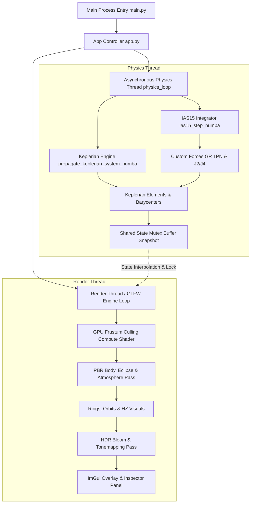

# Stellar-Forge 🌌🪐

[](https://www.python.org/)
[](https://www.opengl.org/)
[](https://numba.pydata.org/)
[](https://naif.jpl.nasa.gov/naif/)
[](LICENSE)

**Stellar-Forge** is a state-of-the-art, interactive N-body gravitational simulation engine and astronomical sandbox built with Python, ModernGL, Numba JIT acceleration, and PyImGui. It provides real-time physics integration, physically based atmospheric raymarching, general relativity orbital precession, higher-order zonal harmonic oblate gravity ($J_2, J_4$), analytical Keplerian propagation, eclipse shadow lookup tables (supporting oblate star geometry), comprehensive body inspection, and seamless integration with NASA JPL SPICE kernels and Horizons ephemeris data.

---

## 🚀 Quick Start / How to Run

### 1. Prerequisites & Dependencies
Ensure you have **Python 3.10+** (64-bit) and a dedicated GPU supporting OpenGL 4.3+.

```bash
# Clone the repository
git clone https://github.com/YourUsername/Stellar-Forge.git
cd Stellar-Forge

# (Optional) Create and activate virtual environment
python -m venv venv
# On Windows:
venv\Scripts\activate
# On Linux/macOS:
source venv/bin/activate

# Install required python packages
pip install numpy moderngl glfw pyrr imgui numba spiceypy requests
```

### 2. Launching the Simulation Engine
- **Windows One-Click Launch**: Double-click `run.bat` or execute in terminal:
  ```cmd
  run.bat
  ```
- **Standard Terminal Launch**:
  ```bash
  python engine/main.py
  ```

### 3. Keyboard & Mouse Controls

#### 🖱️ Mouse Navigation
* **Left Mouse Button (Drag)**: Orbit / rotate the camera (yaw and pitch).
* **Left Mouse Button (Click)**: Select / pick a celestial body in the viewport.
* **Right Mouse Button (Drag)**: Pan the camera target (shifts the look-at target).
* **Scroll Wheel**: Zoom in/out (zoom speed dynamically scales with altitude above the surface to prevent ground-clipping).
* **Shift + Scroll Wheel**: Adjust Field of View (FOV) ($1.0^\circ - 120.0^\circ$).

#### ⌨️ Keyboard Commands
* **Space**: Pause / resume simulation time.
* **Up / Right Arrow**: Double the simulation speed (time multiplier, capped at $10^{12}\times$).
* **Down / Left Arrow**: Halve the simulation speed (minimum $1.0\times$).
* **R**: Reset simulation time multiplier to $1.0\times$.
* **Q / E**: Roll / tilt the camera counter-clockwise / clockwise.
* **Minus (`-`) / Equal (`=`)**: Decrease / increase camera exposure.
* **Shift + Minus (`-`) / Equal (`=`)**: Double-speed decrease / increase of camera exposure.
* **Backslash (`\`) + Click "Export"**: Developer shortcut (only valid when active system is `Solar System`) that updates and dumps all bodies' cosmetics directly into the master `data/system.json`. (Standard **Click "Export"** without `\` saves a single body's cosmetic properties to a JSON file under `exports/`, while custom systems save changes directly).

---

## 📋 Table of Contents

- [Quick Start / How to Run](#-quick-start--how-to-run)
  - [Keyboard & Mouse Controls](#3-keyboard--mouse-controls)
- [Key Features](#-key-features)
- [Physics Engine & Accuracy Testing](#-physics-engine--accuracy-testing)
  - [IAS15 N-Body Integrator](#ias15-n-body-integrator)
  - [Analytical Keplerian Propagation](#analytical-keplerian-propagation)
  - [Relativistic & Oblate Gravity](#relativistic--oblate-gravity)
  - [JPL Horizons Benchmark Results](#jpl-horizons-benchmark-results)
- [Graphics & Rendering Pipeline](#-graphics--rendering-pipeline)
  - [Eclipse Shadows & Oblate Star Support](#eclipse-shadows--oblate-star-support)
  - [Physically Based Atmospheric Scattering](#physically-based-atmospheric-scattering)
  - [Planetary Rings & Planetshine](#planetary-rings--planetshine)
  - [HDR Post-Processing Pyramid](#hdr-post-processing-pyramid)
- [Comprehensive Inspector & Controls](#-comprehensive-inspector--controls)
- [Architecture & Design](#-architecture--design)
- [Project Structure](#-project-structure)
- [Ephemeris & Data Scripts](#-ephemeris--data-scripts)
- [License](#-license)

---

## ✨ Key Features

- **🚀 High-Performance N-Body Integrator**: Implements the **IAS15** (15th-order adaptive step-size integrator by Rein & Spiegel), compiled to machine code via Numba (`@njit(nogil=True)`), enabling ultra-fast simulations outside Python's Global Interpreter Lock (GIL).
- **🪐 Analytical Keplerian Propagation**: $\mathcal{O}(N)$ hierarchical propagation mode utilizing Jacobi coordinates and top-down subsystem barycentric placement to completely eliminate circular dependencies and barycentric wobble. Includes $J_2$, GR, and third-body vector precession.
- **🌌 General Relativity & Zonal Harmonics**: Accurately simulates 1PN (post-Newtonian) Schwarzschild relativistic precession around compact objects and $J_2 / J_4$ oblate gravitational harmonics for fast-rotating giant stars and planets.
- **🌑 Eclipse Shadows & Oblate Star Geometry**: Precomputed eclipse Look-Up Tables (LUTs) casting realistic umbra and penumbra shadows across planet surfaces, atmospheres, and rings, including geometric projection support for oblate stars.
- **🔬 JPL Horizons Accuracy Suite**: Includes automated verification benchmarks (`accuracy_test.py`) that compare 1-year numerical integrations directly against NASA JPL Horizons ground-truth state vectors.
- **🛠️ Comprehensive Body Inspector**: In-depth GUI panel displaying real-time physical properties, osculating Keplerian orbital elements, atmospheric composition, effective thermal equilibrium, spectral type classifications, and dynamic property sliders.
- **☀️ Stellar Classification & Evolution**: Computes effective temperatures, spectral classes (O, B, A, F, G, K, M, L, T, Y), luminosity classes (Hypergiants to Subdwarfs), and dynamic Habitable Zone (HZ) boundaries.
- **🌤️ Atmospheric Raymarching**: Multi-pass sky raymarching powered by precomputed Look-Up Tables (LUTs) for transmittance, single scattering, and multi-scattering across customizable planetary gas compositions.
- **🛰️ NASA JPL SPICE & Horizons Integration**: Real-time position playback using official NAIF SPICE kernels (`.bsp`, `.tpc`, `.tls`) and automatic REST querying of JPL Horizons state vectors.

---

## 🔬 Physics Engine & Accuracy Testing

### IAS15 N-Body Integrator

The core physics N-body integration uses **IAS15**, a 15th-order Gauss-Radau predictor-corrector integrator capable of adaptive step size control down to machine precision.

$$
x(t) = x_0 + v_0 t + \int_0^t \int_0^{\tau} a(t') \, dt' \, d\tau
$$

It evaluates accelerations at specific Gauss-Radau nodes, adapting step sizes based on local truncation error estimates:
$$
\Delta t_{\text{new}} = \Delta t \cdot \left( \frac{\epsilon}{\text{error}} \right)^{1/7}
$$

### Analytical Keplerian Propagation

Stellar-Forge includes an alternate **Analytical Keplerian Mode** for $\mathcal{O}(N)$ complexity simulation. Rather than numerically integrating gravitational equations of motion, it computes exact Keplerian orbits within a hierarchical tree.

#### 1. Jacobi Coordinate Decomposition
Standard hierarchical models suffer from "barycentric wobble" when minor bodies orbit massive bodies that themselves orbit a central barycenter. To solve this, Stellar-Forge uses **Jacobi coordinates**:
- The state of each body is calculated relative to the *barycenter of all inner subsystems* orbiting the same parent.
- This decomposes the N-body system into a sequence of decoupled two-body problems with mass-weighted coordinates.

#### 2. Vector Nodal & Apsidal Precession
To prevent orbit lines from remaining static, the analytical engine includes vector-based perturbations that update elements analytically at each time step:
- **Nodal Precession Vector ($\mathbf{\Omega}_{\text{prec}}$)**: Represents orbital plane regression around the parent's spin axis or third-body normal vector. Calculated from $J_2$ oblateness and third-body (grandparent) gravitational influence.
- **Apsidal Precession ($d\omega/dt$)**: Analytical advance of the periapsis inside the orbital plane, caused by $J_2$ zonal harmonics, general relativity (1PN precession), and third-body resonance.

For each body, the orbit normal vector $\mathbf{n}$ and eccentricity vector $\mathbf{e}$ are precessed via axis-angle rotation:
$$
\mathbf{v}_{\text{new}} = \mathbf{v} \cos\theta + (\mathbf{k} \times \mathbf{v}) \sin\theta + \mathbf{k} (\mathbf{k} \cdot \mathbf{v})(1 - \cos\theta)
$$
Where $\mathbf{k}$ is the unit precession axis, and $\theta = \|\mathbf{\Omega}_{\text{prec}}\| \Delta t$.

#### 3. Top-Down Jacobi Placement
During propagation:
1. Mean anomaly is updated: $M(t) = (M_0 + n \cdot \Delta t) \bmod 2\pi$.
2. The eccentric anomaly $E$ is solved via Kepler's Equation: $M = E - e \sin E$.
3. Precessed $\mathbf{n}$ and $\mathbf{e}$ vectors are used to generate the 3D relative position and velocity.
4. Position and velocity are mapped back from Jacobi coordinates to Cartesian coordinates in a top-down pass through the hierarchy tree.

### Relativistic & Oblate Gravity

1. **General Relativity (1PN Post-Newtonian Correction)**:
   Accounts for perihelion precession near massive objects:
   $$
   \mathbf{a}_{\text{GR}} = \frac{G M}{c^2 r^3} \left( \left[ 4 \frac{G M}{r} - v^2 \right] \mathbf{r} + 4 (\mathbf{r} \cdot \mathbf{v}) \mathbf{v} \right)
   $$

2. **Oblate Harmonics ($J_2, J_4$)**:
   Modifications to gravitational potential due to rotational oblateness:
    $$
    V(r, \theta) = -\frac{GM}{r} \left[ 1 - \sum_{n=2}^4 J_n \left( \frac{R_{eq}}{r} \right)^n P_n(\cos\theta) \right]
    $$

### JPL Horizons Benchmark Results

Stellar-Forge includes automated accuracy testing scripts (`accuracy_test.py`) that benchmark the engine's 1-year (365 days) forward integration against official NASA JPL Horizons ground-truth orbital vectors. 

Errors are decomposed into standard astronomical **RTN (Radial, Transverse/Along-Track, Normal/Cross-Track)** coordinate frames in kilometers. Below are the actual benchmark results:

| Body Name | Total Drift (km) | Ahead/Behind (km) | Radial (km) | Cross-Track (km) |
| :--- | :---: | :---: | :---: | :---: |
| **Mercury** | 0.19 km | -0.19 km | -0.02 km | -0.00 km |
| **Venus** | 0.13 km | -0.13 km | 0.01 km | -0.00 km |
| **Earth** | 0.05 km | -0.05 km | -0.00 km | 0.00 km |
| **Moon** | 0.90 km | 0.90 km | -0.01 km | 0.03 km |
| **Mars** | 0.08 km | 0.07 km | -0.03 km | 0.00 km |
| **Jupiter** | 0.69 km | 0.14 km | 0.67 km | 0.01 km |
| **Saturn** | 0.17 km | 0.15 km | 0.05 km | -0.06 km |
| **Neptune** | 11.15 km | -10.38 km | -2.35 km | -3.33 km |
| **Pluto** | 19.88 km | 14.14 km | -8.14 km | 11.35 km |
| **Ceres** | 0.15 km | 0.09 km | -0.12 km | -0.00 km |
| **Vesta** | 0.20 km | 0.16 km | -0.12 km | 0.00 km |
| **Pallas** | 0.05 km | 0.03 km | -0.03 km | 0.02 km |
| **Haumea** | 0.05 km | -0.04 km | -0.03 km | 0.01 km |
| **Makemake** | 0.03 km | -0.02 km | -0.03 km | 0.00 km |
| **Eris** | 0.04 km | 0.02 km | 0.03 km | -0.02 km |
| **Europa** *(Jovian Moon)* | 15.14 km | 2.41 km | 0.98 km | -14.91 km |
| **Ganymede** *(Jovian Moon)* | 24.72 km | 24.41 km | 0.30 km | -3.88 km |
| **Callisto** *(Jovian Moon)* | 18.00 km | 17.98 km | 0.13 km | 0.65 km |
| **Titan** *(Saturnian Moon)* | 54.93 km | -54.93 km | -0.02 km | -0.13 km |
| **Hyperion** *(Saturnian Moon)* | 58.07 km | -57.92 km | 4.04 km | 0.20 km |
| **Charon** *(Plutonian Moon)* | 17.58 km | -17.58 km | -0.00 km | 0.00 km |
| **Triton** *(Neptunian Moon)* | 230.37 km | -229.30 km | -0.02 km | 22.25 km |

*\*Note: Major planets and dwarf planets achieve sub-kilometer to near-zero positional drift over a full orbital year ($< 0.05 \text{ km}$ for Earth and Eris!). Small close-in moons reflect expected high-frequency tidal and multi-body resonance drift when unmodelled by point-mass dynamics.*

To run the benchmark yourself:
```bash
python scripts/accuracy_test.py
```

---

## 🎨 Graphics & Rendering Pipeline

### Eclipse Shadows & Oblate Star Support
- **Precomputed Eclipse LUT (`u_eclipse_lut`)**: Generates high-precision light attenuation lookup tables bound across spherical planet shaders (`prog_spheres`), rings (`prog_rings`), and atmosphere raymarchers (`prog_atmo`).
- **Oblate Star Geometry**: Corrects light cone and shadow penumbra geometry for fast-rotating, oblate host stars (e.g., Achernar), projecting elliptical stellar disks during eclipses and occultations.

### Physically Based Atmospheric Scattering
Utilizes a multi-step precomputation technique inspired by Bruneton e.a.:
1. **Transmittance LUT**: Precomputes optical depth for Rayleigh and Mie scattering across altitudes and zenith angles.
2. **Multi-Scattering LUT**: Approximates higher-order light bounces inside the atmosphere.
3. **Real-Time Raymarching Shader**: Combines Rayleigh scattering (sky color), Mie scattering (sun halos), and gas absorption in real time.

### Planetary Rings, Planetshine & Ringshine
- **Planetary Rings**: Rendered with dynamic optical depth, Phase functions (supporting forward/backward scattering asymmetry), and self-shadowing cast by the parent planet and companion bodies.
- **Planetshine**: Secondary diffuse light bounced from illuminated planetary disks onto nearby satellites and moons. To keep rendering fast, the aggregate bounce light direction and color are precalculated on the CPU using Numba (`compute_planetshine_numba` in [app.py](file:///d:/Files/Coding/OpenGL/Stellar-Forge/engine/app.py)) and passed as instance attributes to the GPU.
- **Ringshine**: Scattered sunlight from planetary ring planes onto the host planet's surface and its orbiting moons. Calculated in real time on the GPU (in the fragment shader of [shaders.py](file:///d:/Files/Coding/OpenGL/Stellar-Forge/engine/shaders.py)):
  - *For the Host Planet*: Evaluated using a macro-approximation based on the ring plane's area, elevation, solid angle, and a noon-fade term.
  - *For Orbiting Moons*: Dynamically projects the closest ring element to the moon, evaluates a wrapped Lambertian light model to mimic the ring plane's broad area-light profile, and calculates soft penumbral shadow softening as the moon enters/leaves the host planet's cylindrical shadow cylinder.

### HDR Post-Processing Pyramid
1. **Bright Pass Filtering**: Isolates high-intensity pixels above threshold.
2. **Downsample / Upsample Pyramid**: Progressive Gaussian blurring across 5 MIP levels for smooth lens flare blooming.
3. **Tone Mapping**: Configurable ACES Film or Reinhard tone mapping operators converting HDR colors to sRGB monitors with dynamic exposure adjustment.

---

## 🛠️ Comprehensive Inspector & Controls

Stellar-Forge includes a rich, multi-tabbed **Body Inspector** window allowing real-time inspection and modification of celestial objects:

- **Orbital Parameters**: Live displays of semi-major axis ($a$), eccentricity ($e$), inclination ($inc$), argument of periapsis ($\omega$), longitude of ascending node ($\Omega$), mean anomaly ($M$), orbital period, and apoapsis/periapsis distances.
- **Physical & Rotational Properties**: Mass ($M_{\odot}$ or $M_{\oplus}$), mean radius, equatorial radius ($R_{eq}$), rotational period, pole Right Ascension/Declination, and oblateness factor ($f$).
- **Thermal & Climate Inspector**: Effective surface temperature, solar constant flux, Bond albedo, greenhouse multiplier, and atmospheric scale height.
- **Atmosphere Editor**: Dynamic controls for surface pressure (bar), composition fractions (Gas mixtures: $N_2, O_2, CO_2, CH_4, H_2, He$), Rayleigh scattering scale height, and aerosol asymmetry parameters.
- **Stellar Classification**: Automatic HR diagram placement, spectral sub-classing (e.g. G2V, M3III), luminosity output ($L_{\odot}$), and Habitable Zone radii indicators.

---

## 🏗️ Architecture & Design

Stellar-Forge is architected with a decoupled, asynchronous multi-threaded pipeline separating high-rate physics calculations from smooth user rendering.



---

## 📁 Project Structure

```
Stellar-Forge/
├── engine/                      # Core engine python modules
│   ├── app.py                   # Main window, rendering loops, ImGui UI & event handling
│   ├── main.py                  # Entry point script with fault handling and crash loggers
│   ├── physics_core.py          # Numba-compiled IAS15 integrator, custom forces & physics loop
│   ├── kepler_analytical.py     # Analytical Keplerian Jacobi coordinate propagation engine
│   ├── system_manager.py        # System I/O, state snapshots, stellar property derivation
│   ├── spice_manager.py         # NAIF SPICE kernel manager, automated kernel downloader
│   ├── star_calc.py             # Stellar classification, HR diagram statistics & HZ bounds
│   ├── shaders.py               # GLSL shader strings for celestial bodies, atmospheres & LUTs
│   ├── post_shaders.py          # GLSL post-processing shaders (Bloom, HDR Tone Mapping)
│   ├── render_utils.py          # ModernGL buffer handlers & UV sphere mesh generators
│   ├── math_utils.py            # Fast vector operations & Kepler equation solvers
│   ├── atmosphere_physics.py    # Physical atmosphere parameters (Rayleigh, Mie, absorption coefficients, scale height)
│   └── constants.py             # Physical, astronomical constants & conversion ratios
├── data/                        # Simulation data & system presets
│   ├── systems/                 # System JSON profiles (Solar System, Achernar, etc.)
│   ├── kernels/                 # Storage directory for downloaded NAIF SPICE kernels
│   ├── system.json              # Active default planetary system data
│   ├── ephemeris_settings.json  # Configuration for SPICE playback dates & active kernels
│   ├── graphics_settings.json   # Persistent configuration for rendering and graphics qualities
│   └── horizons_cache.json      # Cache file for fetched JPL Horizons API queries
├── scripts/                     # Utility and benchmark scripts
│   ├── fetch_horizons.py        # Fetch J2000 state vectors directly from JPL Horizons REST API
│   ├── perf_test.py             # Benchmark engine startup and frame performance
│   └── accuracy_test.py         # Physics solver validation against JPL Horizons ground truth
├── exports/                     # Exported visual and cosmetic settings for planets
├── run.bat                      # Quick launch batch script for Windows
├── test_spice.py                # Validation script for checking SPICE kernel playback loader
├── imgui.ini                    # Saved ImGui window positions and layout configurations
└── README.md                    # Project documentation
```

---

## 📡 Ephemeris & Data Scripts

### Querying JPL Horizons
To update system initial states with live NASA JPL Horizons ephemerides:
```bash
python scripts/fetch_horizons.py
```

### NAIF SPICE Kernels
The engine automatically downloads essential kernels (`de440s.bsp`, `pck00010.tpc`, `naif0012.tls`) into `data/kernels/` when switching to Ephemeris Mode via the UI. Additional planetary satellite kernels can be downloaded directly through the in-app **Ephemeris Setup** modal.

---

## 📜 License

Distributed under the MIT License. See `LICENSE` for more information.
