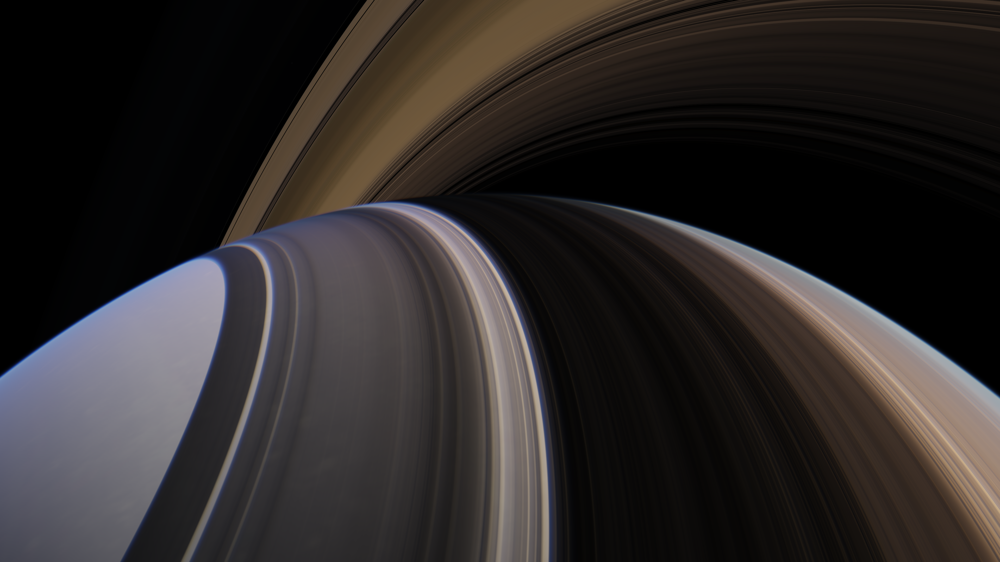
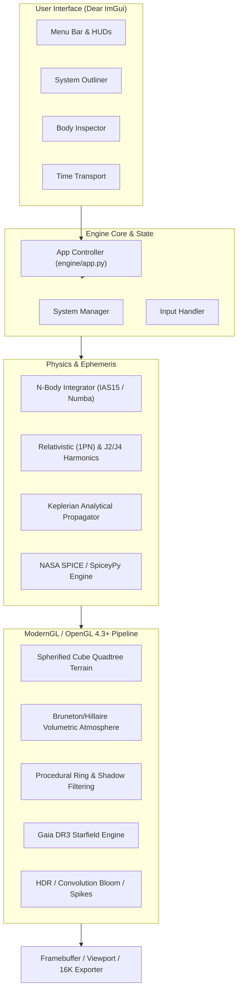

# Stellar-Forge 🌌

[](https://www.python.org/)
[](https://www.opengl.org/)
[](https://github.com/moderngl/moderngl)
[](https://numba.pydata.org/)
[](LICENSE)
[](https://github.com/JustNoetic/Stellar-Forge)

**Stellar-Forge** is an advanced, high-performance astrophysics sandbox, celestial mechanics simulator, and planetary rendering engine built with Python, ModernGL, PyOpenGL, and Numba. It combines scientifically rigorous orbital mechanics with cinematic, physically-based atmospheric and celestial rendering in a fully interactive real-time environment.

---

## 📸 Visual Showcase



---

## ✨ Key Features

### 🪐 1. High-Precision Orbital Mechanics & Ephemeris
- **N-Body Gravitational Dynamics**: High-order numerical integrator (IAS15 adaptive step) accelerated via [`njit`](engine/physics/physics_core.py) in Numba with parallel multi-threading.
- **General Relativistic Corrections (1PN)**: Post-Newtonian corrections computed in Jacobi barycentric coordinates for high-accuracy perihelion precession.
- **Gravitational Oblateness & Zonal Harmonics**: Non-spherical gravitational fields utilizing $J_2$ and $J_4$ harmonic coefficients and arbitrary spin axis orientations.
- **Analytical Keplerian Propagator**: Instantaneous two-body Jacobi propagation for fast-forwarding celestial systems over thousands of simulated years with zero orbital drift.
- **NASA SPICE & JPL Horizons Ephemeris**: Native integration with NASA NAIF SPICE kernels (`.bsp`, `.tls`, `.tpc`) via SpiceyPy and automated JPL Horizons state vector fetching.
- **SPK Trajectory Exporter**: Export custom N-body simulation timelines into standard NASA SPK kernel files (`.bsp`) for external mission analysis.

### 🌤️ 2. Physically-Based Volumetric Atmosphere & Optics
- **Bruneton / Hillaire Scattering Engine**: Precomputed analytical scattering lookup tables (Sky-View LUT, Multi-Scattering LUT, Optical Depth Transmittance LUT).
- **Physical Rayleigh & Mie Scattering**: Realistic scattering parameterized by real atmospheric gas compositions, scale heights, and aerosol densities.
- **Stochastic Raymarching & Denoising**: Jittered raymarching with Interleaved Gradient Noise (IGN) and Spatiotemporal Blue Noise (STBN) combined with Temporal Anti-Aliasing (TAA) accumulation.
- **Atmospheric Refraction & God Rays**: True physical light bending through planetary atmospheric density gradients and volumetric shadow shafts.
- **Variable Rate Shading (VRS)**: Multi-scale atmospheric rendering with bilateral edge-preserving upsampling.
- **Ring Shadows & Secondary Illumination**: Filtered penumbral ring shadows cast onto planetary atmospheres and surfaces, accompanied by dynamic planetshine, moonshine, and oblate ringshine.

### 🏔️ 3. Spherified Cube Quadtree Terrain & Planetary Surfaces

The terrain CPU backend is written in Rust, with native streaming workers and a shared GPU/collision surface. See [terrain backend documentation](docs/terrain_backend.md) for build instructions, tile precision, seam handling and limits.
- **Tangent-Corrected Spherified Cube Quadtree**: SpaceEngine-style multi-resolution quadtree mesh generation that eliminates polar pinches and ensures uniform tessellation.
- **Multi-Level Chunk Streaming**: Dynamic Level-of-Detail (LOD) streaming driven by camera distance and screen-space error metrics.
- **Multi-Map Surface Shader**: Support for high-resolution diffuse, height/normal, specular, city night lights (emission), and dynamic dual-layer cloud shadows.
- **Planetary Surface Landing & Collision**: Seamless transitions from interplanetary space down to planetary ground level with collision detection, surface walking, and automatic horizon leveling.

### ⭐ 4. Astrometry & Starfield Engine
- **Gaia DR3 Star Catalog**: High-density starfield rendering from ESA Gaia DR3 (~460,000 bright stars down to magnitude $G < 10$) packed into compact 32-byte binary records.
- **Hipparcos Bright-Star Supplement**: Integration of bright naked-eye stars ($V < 2.5$) with proper motion propagation from epoch J1991.25 to J2016.0.
- **Accurate Stellar Telemetry**: Real $BP - RP$ photometric color index to sRGB conversion, parallax distance scaling, and proper motion simulation.

### 📷 5. Cinematic Optics & High-Resolution Export
- **HDR & Dynamic Exposure**: 32-bit floating-point HDR framebuffers with logarithmic exposure control and adaptive tone mapping.
- **Diffraction Spikes / Convolution Bloom**: Physically-modeled FFT/convolution bloom supporting 4-spike, 6-spike (JWST / Newtonian), and 8-spike patterns with chromatic rainbow dispersion and camera roll-locking.
- **Extreme-Resolution Screenshot Exporter**: Tile-based render capture allowing ultra-crisp exports at **4K** ($3840 \times 2160$), **8K** ($7680 \times 4320$), and **16K** ($15360 \times 8640$).
- **Photo Accumulation Mode**: Stationary sub-pixel camera jitter and temporal accumulation for pristine, noise-free renders.

### 🖥️ 6. Professional Dear ImGui Workspace
- **System Outliner**: Hierarchical tree of stars, terrestrial planets, gas giants, moons, and asteroids with multi-tiered selection and targeting.
- **Astrophysics Body Inspector**: Live telemetry reporting real-time orbital elements ($a, e, i, \Omega, \omega, \nu$), escape velocity, surface gravity, mean density, stellar habitable zones (runaway / maximum greenhouse limits), and procedural ring / atmosphere tuning.
- **Time Transport HUD**: Variable time warp from $1.0\times$ up to $10^{12}\times$, timeline scrubbing, pause/resume, and exact date/time jumps (UTC and local epoch).
- **Comparison Mode**: Side-by-side rendering and comparison of multiple planetary systems with customizable AU spatial offsets.

---

## 🏗️ Architecture & Tech Stack


```mermaid
flowchart TD
    subgraph UI ["User Interface (Dear ImGui)"]
        MB["Menu Bar & HUDs"]
        SO["System Outliner"]
        BI["Body Inspector"]
        TH["Time Transport"]
    end

    subgraph Core ["Engine Core & State"]
        APP["App Controller (engine/app.py)"]
        SM["System Manager"]
        IH["Input Handler"]
    end

    subgraph Physics ["Physics & Ephemeris"]
        NB["N-Body Integrator (IAS15 / Numba)"]
        REL["Relativistic (1PN) & J2/J4 Harmonics"]
        KP["Keplerian Analytical Propagator"]
        SPICE["NASA SPICE / SpiceyPy Engine"]
    end

    subgraph Rendering ["ModernGL / OpenGL 4.3+ Pipeline"]
        GEO["Spherified Cube Quadtree Terrain"]
        ATM["Bruneton/Hillaire Volumetric Atmosphere"]
        RNG["Procedural Ring & Shadow Filtering"]
        STAR["Gaia DR3 Starfield Engine"]
        POST["HDR / Convolution Bloom / Spikes"]
    end

    UI --> APP
    APP --> Core
    Core --> Physics
    Physics --> Rendering
    Rendering --> FB["Framebuffer / Viewport / 16K Exporter"]
```

### Core Technologies
- **Language**: Python 3.10+
- **Graphics API**: OpenGL 4.3+ Core Profile via [ModernGL](https://github.com/moderngl/moderngl) and [PyOpenGL](https://pyopengl.sourceforge.net/)
- **Windowing & Input**: [GLFW](https://www.glfw.org/)
- **Numerical Computation**: [NumPy](https://numpy.org/), [SciPy](https://scipy.org/), and [Numba JIT](https://numba.pydata.org/)
- **Ephemeris & Astrodynamics**: [SpiceyPy](https://github.com/AndrewAnnex/SpiceyPy) (NASA NAIF SPICE) & JPL Horizons REST API
- **User Interface**: [pyimgui (Dear ImGui)](https://github.com/pyimgui/pyimgui)
- **Math & Geometry**: [Pyrr](https://github.com/adamlwgriffiths/Pyrr) (3D vector and matrix math)
- **Image Processing**: [Pillow (PIL)](https://python-pillow.org/)

---

## 🚀 Quick Start

### Prerequisites
- **Operating System**: Windows 10/11 or modern Linux (Ubuntu/Debian, Fedora, Arch, etc.)
- **GPU**: OpenGL 4.3+ capable graphics card (NVIDIA GTX 900+ / AMD Radeon RX 400+ / Intel Iris Xe or newer)
- **Python**: Python 3.10+ (64-bit recommended)
- **Rust**: Stable Rust 1.88+ for source builds of the terrain extension; prebuilt wheels and packaged releases do not require a compiler.

#### Linux System Packages
Ensure standard OpenGL, GLFW, and Python venv libraries are installed:
- **Debian / Ubuntu**:
  ```bash
  sudo apt update
  sudo apt install python3-venv python3-tk libgl1-mesa-glx libglfw3
  ```
- **Fedora**:
  ```bash
  sudo dnf install python3-tkinter mesa-libGL glfw
  ```
- **Arch Linux**:
  ```bash
  sudo pacman -S python tk mesa glfw
  ```

### Quick Launch
- **Windows**: Double-click [`run.bat`](run.bat) or execute it from CMD/PowerShell:
  ```cmd
  run.bat
  ```
- **Linux**: Make [`run.sh`](run.sh) executable and launch it:
  ```bash
  chmod +x run.sh
  ./run.sh
  ```

The launcher scripts automatically:
1. Detect and create a Python virtual environment (`venv`).
2. Validate and install all required dependencies from [`requirements.txt`](requirements.txt).
3. Configure engine paths and launch [`engine/main.py`](engine/main.py).

### Manual Setup
```bash
# 1. Clone the repository
git clone https://github.com/JustNoetic/Stellar-Forge.git
cd Stellar-Forge

# 2. Create and activate a virtual environment
python -m venv venv
# Windows:
call venv\Scripts\activate
# Linux:
source venv/bin/activate

# 3. Install dependencies
pip install -r requirements.txt

# 4. Build the Rust terrain extension
python scripts/build_terrain.py

# 5. Run the simulation
python engine/main.py
```

---

## 🎮 Controls & Shortcuts

### Navigation & Camera
| Action | Free Flight Mode | Simple Orbit Mode | Surface / Walking Mode |
| :--- | :--- | :--- | :--- |
| **Mouse Left Drag** | Free look (pivot pitch & yaw) | Orbit around target body | Look around |
| **Mouse Right Drag** | Orbit around pivot point | Free look (pivot pitch & yaw) | — |
| **Mouse Left + Right Drag** | Approach / recede from target | Approach / recede from target | — |
| **Mouse Scroll** | Adjust flight speed exponentially | Zoom in / out relative to target | Adjust walk speed |
| **Shift + Mouse Scroll** | Adjust Field of View (FOV) | Adjust Field of View (FOV) | Adjust Field of View (FOV) |
| **W / A / S / D** | Fly Forward / Left / Backward / Right | Move camera translation | Walk Forward / Left / Back / Right |
| **Q / E** | Roll camera counter-clockwise / clockwise | Roll camera | — |
| **F** | Snap camera look to tracked body | Snap camera look to tracked body | Align view to horizon |

### Simulation & Viewport Shortcuts
| Key | Function |
| :--- | :--- |
| <kbd>Space</kbd> | Toggle Simulation Pause / Resume |
| <kbd>↑</kbd> or <kbd>→</kbd> | Double simulation speed ($2\times$) |
| <kbd>↓</kbd> or <kbd>←</kbd> | Halve simulation speed ($0.5\times$) |
| <kbd>R</kbd> | Reset simulation speed to real-time ($1.0\times$) |
| <kbd>-</kbd> / <kbd>=</kbd> | Decrease / Increase exposure (<kbd>Shift</kbd> for $2\times$ multiplier) |
| <kbd>H</kbd> | Toggle Dear ImGui user interface visibility |
| <kbd>F11</kbd> | Toggle Fullscreen |
| <kbd>F12</kbd> | Capture High-Resolution Screenshot (Preset: 4K / 8K / 16K) |
| <kbd>Esc</kbd> | Deselect body / close active modal window |

---

## 🛠️ Offline Data Pipelines & Scripts

Stellar-Forge includes dedicated offline tools in [`scripts/`](scripts):

### 1. Planetary Map Tile Baker ([`bake_planet_tiles.py`](scripts/bake_planet_tiles.py))
Converts high-resolution equirectangular planetary maps (diffuse, bump, night lights, specular) into tangent-corrected Spherified Cube Quadtree pyramids:
```bash
python scripts/bake_planet_tiles.py --input textures/earth_8k.jpg --body Earth --map-type diffuse --max-lod 5
```
*Output hierarchy:* `data/tiles/{body}/{map_type}/{face}/{lod}/{x}_{y}.png` (pixel-centred content plus two gutter texels; height is 16-bit)

### 2. Gaia DR3 Star Catalog Downloader ([`fetch_gaia.py`](scripts/fetch_gaia.py))
Queries ESA Gaia Archive TAP (and VizieR TAP) in RA bands to compile magnitude-limited stars into a packed 32-byte binary format:
```bash
python scripts/fetch_gaia.py            # Builds data/gaia/stars.bin (~460,000 stars, G < 10)
python scripts/fetch_gaia.py --test     # Downloads small sample (G < 7) for testing
```

### 3. JPL Horizons State Vector Harvester ([`fetch_horizons.py`](scripts/fetch_horizons.py))
Queries JPL Horizons REST API to fetch barycentric cartesian state vectors at epoch J2000 for all bodies in the system:
```bash
python scripts/fetch_horizons.py
```

### 4. Ephemeris Validation & Performance Benchmarks
- [`accuracy_test.py`](scripts/accuracy_test.py): Validates N-body numerical integration accuracy against JPL Horizons real-world ephemerides over long time baselines.
- [`perf_test.py`](scripts/perf_test.py): Profiles per-section CPU cost and GPU timers (`GL_TIME_ELAPSED`) across geometry, atmosphere, shadow, and post-processing passes.
- [`benchmark_atmo_shadows.py`](scripts/benchmark_atmo_shadows.py): Benchmarks volumetric atmospheric raymarching and ring shadow algorithms under various resolutions.

---

## 📦 Standalone Build & Distribution

To compile a standalone Windows executable (`Stellar-Forge.exe`) without requiring end-users to have Python installed:

```cmd
build.bat
```

The build script:
- Compiles the application via PyInstaller using [`stellar_forge.spec`](stellar_forge.spec).
- Stages external user-editable directories (`data/`, `textures/`, `exports/`).
- Packages a lightweight distribution archive: `dist/Stellar-Forge-v1.0.0-Windows.zip`.

---

## 📁 Repository Structure

```
Stellar-Forge/
├── engine/                       # Core simulation and rendering engine
│   ├── app.py                    # Main application loop, camera, and render manager
│   ├── main.py                   # Application entrypoint and crash handler
│   ├── path_utils.py             # Bundle and external directory path resolution
│   ├── core/                     # Constants, math utilities, and input handling
│   │   ├── constants.py          # Astronomical units, physical constants, defaults
│   │   ├── input_handler.py      # GLFW event handling and settings persistence
│   │   └── math_utils.py         # Keplerian/Cartesian transforms, coordinate rotators
│   ├── physics/                  # Astrodynamics and physics models
│   │   ├── physics_core.py       # N-Body IAS15 integrator, 1PN relativity, J2/J4
│   │   ├── kepler_analytical.py  # Analytical Keplerian orbit propagator (Numba)
│   │   ├── atmosphere_physics.py # Rayleigh and Mie scattering models
│   │   ├── refraction.py         # True atmospheric refraction ray-tracing
│   │   └── star_calc.py          # Stellar evolution, luminosity, and habitable zones
│   ├── ephemeris/                # NASA SPICE & JPL Horizons management
│   │   ├── spice_manager.py      # SPICE kernel loader and ephemeris querying
│   │   ├── system_manager.py     # Star system hierarchy and snapshot storage
│   │   └── spk_exporter.py       # Asynchronous SPK kernel generator
│   ├── rendering/                # ModernGL & OpenGL graphics subsystems
│   │   ├── terrain_quadtree.py   # Spherified cube quadtree LOD geometry
│   │   ├── terrain_streamer.py   # Asynchronous tile quadtree streamer
│   │   ├── terrain_collision.py  # Surface terrain collision and altitude computation
│   │   ├── scattering_lut.py     # Atmospheric LUT generator (Sky-View, Multi-Scatter)
│   │   ├── ring_generator.py     # Procedural planetary ring texture generator
│   │   ├── ring_shadow_filter.py # Filtered penumbral ring shadows
│   │   ├── star_catalog.py       # Gaia DR3 binary catalog loader and renderer
│   │   ├── planetshine.py        # Secondary planetshine and moonshine models
│   │   ├── texture_manager.py    # Surface map binder and texture streaming
│   │   └── post_shaders.py       # HDR composite, FFT bloom, diffraction spikes
│   ├── ui/                       # Dear ImGui interface modules
│   │   ├── menu_bar.py           # Main top menu bar
│   │   ├── outliner.py           # Left-side celestial hierarchy outliner
│   │   ├── inspector.py          # Right-side astrophysical body telemetry
│   │   ├── time_hud.py           # Bottom time transport and timeline controls
│   │   ├── viewport_hud.py       # Floating navigation and geometry statistics
│   │   └── modals.py             # Modals: graphics settings, body creator, SPICE
│   └── glsl/                     # High-performance GLSL shaders
│       ├── atmosphere/           # Raymarching, LUT bakes, god rays shaders
│       ├── celestial/            # Sphere, terrain, ring, orbit, starfield shaders
│       ├── common/               # Shadow filtering, refraction, coordinate transforms
│       ├── compute/              # Frustum culling and orbit compute shaders
│       └── post/                 # HDR, convolution bloom, and tone mapping
├── assets/                       # Curated demo screenshots and media for documentation
├── data/                         # Systems, ephemeris kernels, and Gaia star catalog
├── scripts/                      # Offline preprocessing tools and benchmarks
├── textures/                     # Planet surfaces, ring profiles, bloom kernels
├── screenshots/                  # High-resolution captures and render gallery (git-ignored)
├── requirements.txt              # Python package dependencies
├── run.bat                       # Automated setup and launcher batch script (Windows)
├── run.sh                        # Automated setup and launcher shell script (Linux)
├── build.bat                     # PyInstaller standalone compilation script
├── stellar_forge.spec            # PyInstaller build specification
└── LICENSE                       # MIT License
```

---

## 📄 License

This project is licensed under the **MIT License** — see the [LICENSE](LICENSE) file for complete details.

---

## 🌟 Acknowledgements & References

- **NASA NAIF SPICE**: Precision planetary ephemerides and spacecraft trajectory data ([NAIF](https://naif.jpl.nasa.gov/naif/)).
- **ESA Gaia Mission**: Gaia Data Release 3 (DR3) bright star catalog ([ESA Gaia](https://www.cosmos.esa.int/web/gaia)).
- **NASA JPL Horizons**: Real-time solar system dynamics and ephemeris web service ([JPL SSD](https://ssd.jpl.nasa.gov/)).
- **Bruneton & Neyret / Sébastien Hillaire**: Groundwork on precomputed atmospheric scattering and scalable sky view lookup tables.
- **SpaceEngine**: Conceptual inspiration for logarithmic camera flight scaling and spherified cube planetary quadtrees.
