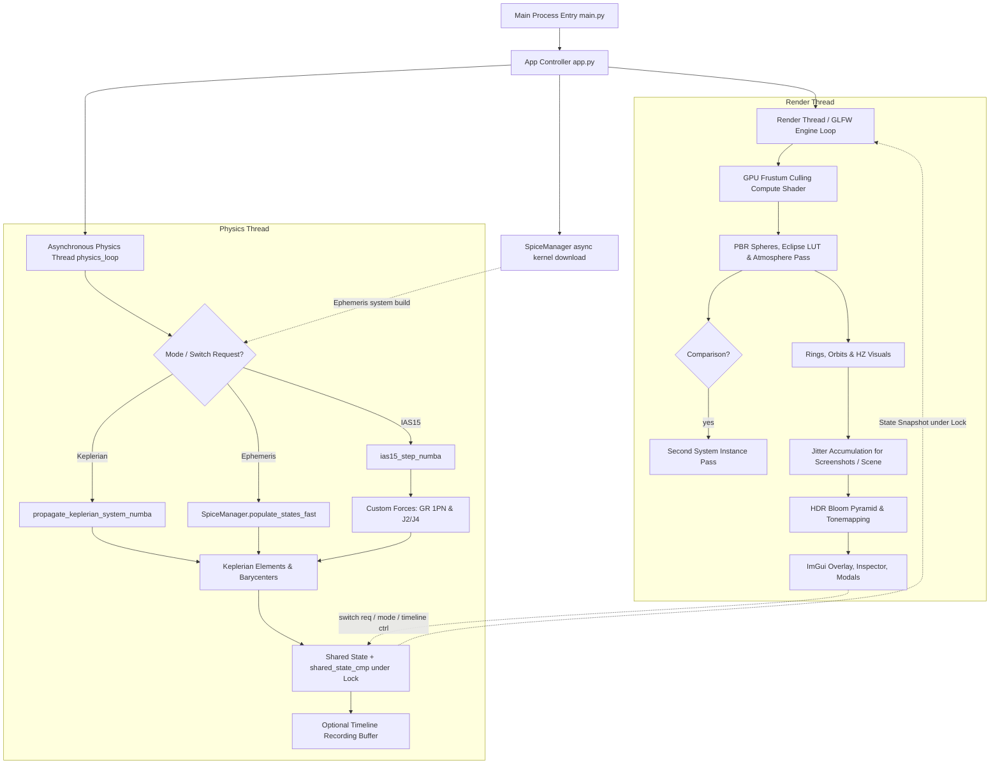

# Stellar-Forge 🌌🪐

[](https://www.python.org/)
[](https://www.opengl.org/)
[](https://numba.pydata.org/)
[](https://naif.jpl.nasa.gov/naif/)
[](../../releases)
[](LICENSE)

**Stellar-Forge** is a state-of-the-art, interactive N-body gravitational simulation engine and astronomical sandbox built with Python, ModernGL (OpenGL 4.6), Numba JIT acceleration, and PyImGui. It ships with **three switchable simulation modes** — a 15th-order **IAS15** N-body integrator, an **analytical Keplerian** propagator, and live **NASA SPICE ephemeris playback** — and provides physically based atmospheric raymarching, general relativity orbital precession, higher-order zonal harmonic oblate gravity ($J_2, J_4$), eclipse shadow lookup tables (supporting oblate star geometry), HDR bloom post-processing, jitter accumulation for high-quality screenshots and scene rendering, a comprehensive body inspector, side-by-side **system comparison**, **timeline recording & scrubbing**, an in-app **system / body editor**, and seamless integration with NASA JPL SPICE kernels and Horizons ephemeris data.

---

## 🚀 Quick Start / How to Run

### Option A — Standalone Windows .exe (No Python Required)

1. Download the latest **`Stellar-Forge-vX.Y.Z-Windows.zip`** from the [**Releases**](../../releases) page.
2. Extract the zip anywhere — keep all folders (`data/`, `textures/`, `exports/`) next to the `.exe`.
3. Double-click **`Stellar-Forge.exe`** to launch.

> **Requirements:** Windows 10/11 64-bit, GPU with **OpenGL 3.3+** (any dedicated GPU from the last decade), up-to-date graphics drivers.
>
> **SPICE kernels (~4 GB) are not included in the zip.** The app downloads them automatically on first use via the **Ephemeris** panel.
>
> If the app crashes silently, check `main_error.txt` next to the `.exe` for the full traceback.

### Option B — Run from Source (Python)

#### 1. Prerequisites & Dependencies
Ensure you have **Python 3.10+** (64-bit) and a dedicated GPU supporting OpenGL 4.3+.

```bash
# Clone the repository
git clone https://github.com/YourUsername/Stellar-Forge.git
cd Stellar-Forge

# (Optional) Create and activate virtual environment
python -m venv venv
# On Windows:
venv\Scripts\activate
# On Linux/macOS:
source venv/bin/activate

# Install required python packages
pip install -r requirements.txt
```

#### 2. Launching the Simulation Engine
- **Windows One-Click Launch**: Double-click `run.bat` or execute in terminal. This launcher automatically creates/verifies the virtual environment and installs any missing dependencies on startup:
  ```cmd
  run.bat
  ```
- **Standard Terminal Launch**:
  ```bash
  python engine/main.py
  ```

### 3. Keyboard & Mouse Controls

#### 🖱️ Mouse Navigation & Movement Settings
Stellar-Forge supports two switchable camera control modes, selectable via the **Controls** dropdown in the Control Panel or the **Graphics & Quality Settings** modal:

##### 1. Simple Orbit Mode
* **Left Mouse Button (Drag)**: Orbit the camera around the tracked celestial body or target pivot (keeps target centered).
* **Scroll Wheel**: Smoothly zoom in / zoom out relative to the object surface (altitude-aware scaling).
* **Right Mouse Button (Drag)**: Pivot the camera in place (free look) to inspect the surrounding sky/stars.
* **Left Mouse Button (Click)**: Select / pick a celestial body in the viewport.
* **Left + Right Mouse Button (Drag)**: Alternative smooth radial approach / recede gesture.
* **Shift + Scroll Wheel**: Adjust Field of View (FOV) ($1.0^\circ - 120.0^\circ$).

##### 2. Free Flight Mode (Space Engine Style)
* **Left Mouse Button (Drag)**: Pivot the camera in place (free look).
* **Right Mouse Button (Drag)**: Orbit the camera around the tracked body.
* **Scroll Wheel**: Change flight velocity (~1.15×–2× per notch, capped at 100 light-years/s).
* **Left Mouse Button (Click)**: Select / pick a celestial body in the viewport.
* **Left + Right Mouse Button (Drag)**: Approach / recede from the tracked body's surface (drag down = move closer, up = pull back).
* **Shift + Scroll Wheel**: Adjust Field of View (FOV) ($1.0^\circ - 120.0^\circ$).

#### ⌨️ Keyboard Commands
* **W / S / A / D (hold)**: Fly forward / backward / strafe in flight mode; walk along the surface when landed.
* **Space**: Pause / resume simulation time.
* **Up / Right Arrow**: Double the simulation speed (time multiplier, capped at $10^{12}\times$).
* **Down / Left Arrow**: Halve the simulation speed (minimum $1.0\times$).
* **R**: Reset simulation time multiplier to $1.0\times$.
* **Q / E (hold)**: Roll / tilt the camera counter-clockwise / clockwise.
* **H**: Toggle full UI visibility on/off for cinematic screenshots and views.
* **F12**: Capture high-resolution screenshot (at selected preset: 4K, 8K, 16K).
* **Minus (`-`) / Equal (`=`)**: Decrease / increase camera exposure.
* **Shift + Minus (`-`) / Equal (`=`)**: Double-speed decrease / increase of camera exposure.
* **Backslash (`\`) + Click "Export"**: Developer shortcut (only valid when active system is `Solar System`) that updates and dumps all bodies' cosmetics directly into the master `data/system.json`. (Standard **Click "Export"** without `\` saves a single body's cosmetic properties to a JSON file under `exports/`, while custom systems save changes directly).

---

## 📋 Table of Contents

- [Quick Start / How to Run](#-quick-start--how-to-run)
  - [Keyboard & Mouse Controls](#3-keyboard--mouse-controls)
- [Key Features](#-key-features)
- [Physics Engine & Accuracy Testing](#-physics-engine--accuracy-testing)
  - [IAS15 N-Body Integrator](#ias15-n-body-integrator)
  - [Analytical Keplerian Propagation](#analytical-keplerian-propagation)
  - [Relativistic & Oblate Gravity](#relativistic--oblate-gravity)
  - [JPL Horizons Benchmark Results](#jpl-horizons-benchmark-results)
- [Graphics & Rendering Pipeline](#-graphics--rendering-pipeline)
  - [Planetary Terrain & Cloud Quadtree LOD (SpaceEngine Style)](#planetary-terrain--cloud-quadtree-lod-spaceengine-style)
  - [Eclipse Shadows & Oblate Star Support](#eclipse-shadows--oblate-star-support)
  - [Physically Based Atmospheric Scattering & Refraction](#physically-based-atmospheric-scattering--refraction)
  - [Dynamic Cloud Rendering](#dynamic-cloud-rendering)
  - [Planetary Rings, Planetshine & Ringshine](#planetary-rings-planetshine--ringshine)
  - [Gravitational Lensing & Black Hole Shadows](#gravitational-lensing--black-hole-shadows)
  - [HDR, Bloom & Orbit MSAA](#hdr-bloom--orbit-msaa)
- [Simulation Modes](#-simulation-modes)
- [Comprehensive Inspector & Controls](#-comprehensive-inspector--controls)
  - [System Comparison & Timeline](#system-comparison--timeline)
  - [System & Body Editor](#system--body-editor)
- [Architecture & Design](#-architecture--design)
- [Project Structure](#-project-structure)
- [Project Map for Contributors / LLMs](#-project-map-for-contributors--llms)
- [Ephemeris & Data Scripts](#-ephemeris--data-scripts)
- [License](#-license)

---

## ✨ Key Features

- **🚀 High-Performance N-Body Integrator**: Implements the **IAS15** (15th-order adaptive step-size integrator by Rein & Spiegel), compiled to machine code via Numba (`@njit(nogil=True)`), enabling ultra-fast simulations outside Python's Global Interpreter Lock (GIL).
- **🪐 Analytical Keplerian Propagation**: $\mathcal{O}(N)$ hierarchical propagation mode utilizing Jacobi coordinates and top-down subsystem barycentric placement to completely eliminate circular dependencies and barycentric wobble. Includes $J_2$, GR, and third-body vector precession.
- **🌌 General Relativity & Zonal Harmonics**: Accurately simulates 1PN (post-Newtonian) Schwarzschild relativistic precession around compact objects and $J_2 / J_4$ oblate gravitational harmonics for fast-rotating giant stars and planets.
- **🏔️ SpaceEngine-Style Planetary Terrain & Cloud Quadtree LOD**: Continuous Level of Detail (LOD) for planetary surfaces and clouds based on spherified cube quadtrees with tangent-warped grid coordinates ($x' = \tan(u \pi / 4)$) and perimeter skirt stitching. Backed by an asynchronous tiled virtual texture streaming engine (`TerrainTileStreamer`) with hierarchical ancestor fallback, normalized spheroid-to-sphere horizon culling for oblate bodies, physically accurate ground atmospheric light extinction (zero-ambient nightside, Rozenberg curved-atmosphere air mass, Rayleigh/Mie/Ozone extinction, diffuse daylight skylight), dynamic cloud LOD shells with semi-transparency extraction and two-sided lighting, switchable patch grid resolutions (8x8 to 64x64), and a real-time Geometry Statistics HUD.
- **🌑 Eclipse Shadows & Oblate Star Geometry**: Precomputed eclipse Look-Up Tables (LUTs) casting realistic umbra and penumbra shadows across planet surfaces, atmospheres, and rings, including geometric projection support for oblate stars.
- **🔬 JPL Horizons Accuracy Suite**: Includes automated verification benchmarks (`accuracy_test.py`) that compare 1-year numerical integrations directly against NASA JPL Horizons ground-truth state vectors.
- **🛠️ Comprehensive Body Inspector**: In-depth GUI panel displaying real-time physical properties, osculating Keplerian orbital elements, atmospheric composition, effective thermal equilibrium, spectral type classifications, and dynamic property sliders.
- **☀️ Stellar Classification & Evolution**: Computes effective temperatures, spectral classes (O, B, A, F, G, K, M, L, T, Y), luminosity classes (Hypergiants to Subdwarfs), and dynamic Habitable Zone (HZ) boundaries.
- **🌤️ Atmospheric Raymarching**: Multi-pass sky raymarching powered by precomputed Look-Up Tables (LUTs) for transmittance, single scattering, and multi-scattering across customizable planetary gas compositions.
- **☁️ Dynamic Cloud Layers**: Physically grounded cloud shells utilizing true atmospheric scale-height (based on gravity, temperature, and molar mass) to calculate tropopause altitudes dynamically. Supports native PNG alpha channels or automatic grayscale-to-alpha mapping for JPG textures, seamlessly blended into the atmospheric scattering with depth-aware volumetric aerial perspective.
- **🛰️ NASA JPL SPICE & Horizons Integration**: Real-time position playback using official NAIF SPICE kernels (`.bsp`, `.tpc`, `.tls`) with automatic kernel discovery & threaded downloading, plus REST querying of JPL Horizons state vectors. Ephemeris systems can be **exported to N-body system JSON** for further simulation.
- **⚖️ System Comparison Mode**: Side-by-side rendering of two systems (e.g. IAS15 vs. Keplerian, or two presets) sharing the same camera, with independent time controls and a dedicated comparison inspector.
- **⏯️ Timeline Recording & Scrubbing**: Record a system's full evolution into a position/velocity buffer and scrub or play it back frame-by-frame — useful for replaying close encounters and validating integration stability.
- **🧊 Orbit MSAA**: Orbit lines are rendered into a dedicated multisample buffer (0×/2×/4×/8×) so they stay crisp while the rest of the scene renders at full native resolution without MSAA.
- **🧰 System & Body Editor**: In-app **Create New System** wizard, **Add Orbiting Body** placer, and a per-body **Export** workflow for cosmetics. Custom systems persist edits directly; the Solar System supports a developer `\`+Export shortcut to dump all cosmetics into the master `data/system.json`.

---

## 🔬 Physics Engine & Accuracy Testing

### IAS15 N-Body Integrator

The core physics N-body integration uses **IAS15**, a 15th-order Gauss-Radau predictor-corrector integrator capable of adaptive step size control down to machine precision.

$$
x(t) = x_0 + v_0 t + \int_0^t \int_0^{\tau} a(t') \, dt' \, d\tau
$$

It evaluates accelerations at specific Gauss-Radau nodes, adapting step sizes based on local truncation error estimates:
$$
\Delta t_{\text{new}} = \Delta t \cdot \left( \frac{\epsilon}{\text{error}} \right)^{1/7}
$$

### Analytical Keplerian Propagation

Stellar-Forge includes an alternate **Analytical Keplerian Mode** for $\mathcal{O}(N)$ complexity simulation. Rather than numerically integrating gravitational equations of motion, it computes exact Keplerian orbits within a hierarchical tree.

#### 1. Jacobi Coordinate Decomposition
Standard hierarchical models suffer from "barycentric wobble" when minor bodies orbit massive bodies that themselves orbit a central barycenter. To solve this, Stellar-Forge uses **Jacobi coordinates**:
- The state of each body is calculated relative to the *barycenter of all inner subsystems* orbiting the same parent.
- This decomposes the N-body system into a sequence of decoupled two-body problems with mass-weighted coordinates.

#### 2. Vector Nodal & Apsidal Precession
To prevent orbit lines from remaining static, the analytical engine includes vector-based perturbations that update elements analytically at each time step:
- **Nodal Precession Vector ($\mathbf{\Omega}_{\text{prec}}$)**: Represents orbital plane regression around the parent's spin axis or third-body normal vector. Calculated from $J_2$ oblateness and third-body (grandparent) gravitational influence.
- **Apsidal Precession ($d\omega/dt$)**: Analytical advance of the periapsis inside the orbital plane, caused by $J_2$ zonal harmonics, general relativity (1PN precession), and third-body resonance.

For each body, the orbit normal vector $\mathbf{n}$ and eccentricity vector $\mathbf{e}$ are precessed via axis-angle rotation:
$$
\mathbf{v}_{\text{new}} = \mathbf{v} \cos\theta + (\mathbf{k} \times \mathbf{v}) \sin\theta + \mathbf{k} (\mathbf{k} \cdot \mathbf{v})(1 - \cos\theta)
$$
Where $\mathbf{k}$ is the unit precession axis, and $\theta = \|\mathbf{\Omega}_{\text{prec}}\| \Delta t$.

#### 3. Top-Down Jacobi Placement
During propagation:
1. Mean anomaly is updated: $M(t) = (M_0 + n \cdot \Delta t) \bmod 2\pi$.
2. The eccentric anomaly $E$ is solved via Kepler's Equation: $M = E - e \sin E$.
3. Precessed $\mathbf{n}$ and $\mathbf{e}$ vectors are used to generate the 3D relative position and velocity.
4. Position and velocity are mapped back from Jacobi coordinates to Cartesian coordinates in a top-down pass through the hierarchy tree.

### Relativistic & Oblate Gravity

1. **General Relativity (1PN Post-Newtonian Correction)**:
   Accounts for perihelion precession near massive objects:
   $$
   \mathbf{a}_{\text{GR}} = \frac{G M}{c^2 r^3} \left( \left[ 4 \frac{G M}{r} - v^2 \right] \mathbf{r} + 4 (\mathbf{r} \cdot \mathbf{v}) \mathbf{v} \right)
   $$

2. **Oblate Harmonics ($J_2, J_4$)**:
   Modifications to gravitational potential due to rotational oblateness:
    $$
    V(r, \theta) = -\frac{GM}{r} \left[ 1 - \sum_{n=2}^4 J_n \left( \frac{R_{eq}}{r} \right)^n P_n(\cos\theta) \right]
    $$

### JPL Horizons Benchmark Results

Stellar-Forge includes automated accuracy testing scripts (`accuracy_test.py`) that benchmark the engine's 1-year (365 days) forward integration against official NASA JPL Horizons ground-truth orbital vectors. 

Errors are decomposed into standard astronomical **RTN (Radial, Transverse/Along-Track, Normal/Cross-Track)** coordinate frames in kilometers. Below are the actual benchmark results:

| Body Name | Total Drift (km) | Ahead/Behind (km) | Radial (km) | Cross-Track (km) |
| :--- | :---: | :---: | :---: | :---: |
| **Mercury** | 0.19 km | -0.19 km | -0.02 km | -0.00 km |
| **Venus** | 0.13 km | -0.13 km | 0.01 km | -0.00 km |
| **Earth** | 0.05 km | -0.05 km | -0.00 km | 0.00 km |
| **Moon** | 0.90 km | 0.90 km | -0.01 km | 0.03 km |
| **Mars** | 0.08 km | 0.07 km | -0.03 km | 0.00 km |
| **Jupiter** | 0.07 km | -0.02 km | 0.07 km | 0.00 km |
| **Saturn** | 0.05 km | 0.04 km | 0.01 km | -0.01 km |
| **Uranus** | 88.98 km | -50.56 km | 73.17 km | -2.74 km |
| **Neptune** | 0.08 km | 0.05 km | -0.06 km | -0.01 km |
| **Pluto** | 1.87 km | -1.87 km | 0.07 km | -0.05 km |
| **Ceres** | 0.15 km | 0.09 km | -0.12 km | -0.00 km |
| **Vesta** | 0.20 km | 0.16 km | -0.12 km | 0.00 km |
| **Pallas** | 0.05 km | 0.03 km | -0.03 km | 0.02 km |
| **Haumea** | 0.05 km | -0.04 km | -0.03 km | 0.01 km |
| **Makemake** | 0.03 km | -0.02 km | -0.03 km | 0.00 km |
| **Eris** | 0.04 km | 0.02 km | 0.03 km | -0.02 km |
| **Europa** *(Jovian Moon)* | 15.14 km | 2.41 km | 0.98 km | -14.91 km |
| **Ganymede** *(Jovian Moon)* | 24.72 km | 24.41 km | 0.30 km | -3.88 km |
| **Callisto** *(Jovian Moon)* | 18.00 km | 17.98 km | 0.13 km | 0.65 km |
| **Titan** *(Saturnian Moon)* | 10.25 km | -10.25 km | -0.01 km | -0.01 km |
| **Hyperion** *(Saturnian Moon)* | 9.55 km | -9.51 km | 0.84 km | -0.02 km |
| **Charon** *(Plutonian Moon)* | 17.58 km | -17.58 km | -0.00 km | 0.00 km |
| **Triton** *(Neptunian Moon)* | 18.98 km | -16.89 km | -0.01 km | 8.65 km |

*\*Note: Major planets and dwarf planets achieve sub-kilometer to near-zero positional drift over a full orbital year ($< 0.05 \text{ km}$ for Earth and Eris!). Small close-in moons reflect expected high-frequency tidal and multi-body resonance drift when unmodelled by point-mass dynamics.*

To run the benchmark yourself:
```bash
python scripts/accuracy_test.py
```

---

## 🎨 Graphics & Rendering Pipeline

### Planetary Terrain & Cloud Quadtree LOD (SpaceEngine Style)

Stellar-Forge incorporates a continuous Level of Detail (LOD) planetary terrain and cloud rendering engine inspired by SpaceEngine. It allows seamless, artifact-free camera flight from deep interplanetary orbit down to planetary ground level with constant VRAM usage:

1. **Spherified Cube Quadtree Architecture**:
   - Decomposes celestial bodies into six root cube faces ($+X, -X, +Y, -Y, +Z, -Z$) subdivided hierarchically based on camera distance, screen height, field of view, and Screen Space Error (SSE).
   - **Tangent-Corrected Distortion Warping**: Direct cube-to-sphere normalization results in severe area distortion, compressing cube corners by $\sim 3\times$ relative to face centers. Stellar-Forge applies tangent coordinate warping to maintain uniform texel and polygon density across the entire sphere:
     $$x' = \tan\left(u \cdot \frac{\pi}{4}\right), \quad y' = \tan\left(v \cdot \frac{\pi}{4}\right), \quad \mathbf{P}_{\text{cube}} = \frac{(x', y', 1)}{\sqrt{x'^2 + y'^2 + 1}}$$
   - **Perimeter Skirt Stitching**: To eliminate cracks, gaps, and T-junction seams between adjacent quadtree patches of disparate LOD levels, each patch mesh includes border skirt vertices (`skirt_flag = 1.0`) extruded radially inward by a depth proportional to the patch's radius:
     $$P_{\text{skirt}} = P_{\text{surface}} - \hat{\mathbf{n}} \cdot d_{\text{skirt}}$$
     Skirts are automatically bypassed for cloud shells to prevent vertical opacity artifacts.
   - **Dynamic Patch Grid Resolution**: Switchable at runtime via the Graphics & Quality modal:
     - `8x8` grid: 192 triangles per patch (lightweight for broad terrain coverage).
     - `16x16` grid: 768 triangles per patch (balanced).
     - `32x32` grid: 3,072 triangles per patch (default, crisp curvature).
     - `64x64` grid: 8,704 triangles per patch (ultra-dense geometric detail).

2. **Oblate Horizon & View Frustum Culling**:
   - Rotational flattening (e.g. Saturn with $f = 0.098$ or rapid rotators with $f > 0.2$) causes naive spherical horizon tests to prematurely cull equatorial nodes or leak backside patches at the poles.
   - Stellar-Forge maps camera positions and patch bounding spheres into **normalized spheroid-to-sphere coordinates**:
     $$\mathbf{C}_{\text{sphere}} = \left(C_x, \, \frac{C_y}{1 - f}, \, C_z\right)$$
     In this transformed metric space, the oblate body is an exact unit sphere, enabling exact analytical horizon culling ($\theta_{\text{cull}} = \theta_{\text{horizon}} + \arcsin(R_{\text{patch}} / R_{\text{planet}})$). This completely prevents backside polygon leaks and ensures seamless LOD subdivision across all latitudes.
   - **Local 6-Plane View Frustum Culling**: Quadtree traversal incorporates analytical bounding sphere testing against camera frustum planes dynamically transformed into the planet's local rotated frame. Nodes outside the view cone are pruned immediately at root and low LODs, slashing rendered patches and triangle counts by $>99\%$ during narrow/low FOV (telescope view) and preventing off-screen triangle blowup.
   - Traversal and patch staging are compiled with Numba (`_traverse_quadtree_jit`, `pack_terrain_patches_jit`, `pack_cloud_patches_jit`), evaluating the full planetary tree in $< 0.1\text{ ms}$ on CPU with zero per-frame Python memory allocations and staging into a streamlined 80-byte SSBO layout. Dispatched via zero-overhead GPU indirect draw commands (`DrawElementsIndirectCommand`), supporting simultaneous multi-body terrain and cloud quadtree rendering.

3. **Asynchronous Tiled Texture Streaming (`TerrainTileStreamer`)**:
   - Fixed VRAM budget backed by a dedicated ModernGL `Texture2DArray` pool (256 slices of $512 \times 512$ RGBA8).
   - Multi-layer support (`"diffuse"` and `"clouds"`).
   - Directory listing cache (`_dir_file_cache`) and in-flight request deduplication eliminate redundant disk I/O and GIL contention during flight.
   - Vectorized batch residency lookup (`resolve_tiles_batch`) with targeted per-face sub-caching amortizes tile residency queries.
   - Dedicated background I/O worker thread loads tiles asynchronously from disk (`data/tiles/<body_name>/<layer>/<lod>/<x>_<y>.jpg`), preventing frame stutter.
   - **Hierarchical Ancestor Fallback**: If a requested high-resolution LOD tile is still streaming from disk, the streamer queries the quadtree hierarchy in $\mathcal{O}(\text{LOD})$ for the nearest loaded ancestor tile, dynamically calculating sub-rect UV transformations:
     $$\text{UV}_{\text{sample}} = \text{UV}_{\text{patch}} \cdot \text{scale} + \text{offset}$$
     This guarantees zero black/gray placeholder flashes or texture pop-in during aggressive camera flight.

4. **Atmospheric Ground Light Extinction & Zero-Ambient Nightside**:
   - **Strict Zero-Ambient Nightside**: Ground surfaces have zero artificial ambient light (`vec3(0.03)` ambient floor removed), ensuring unlit nighttime hemispheres and eclipse shadows evaluate to pitch black ($0.0$).
   - **Lambertian Law with Stellar Disc Penumbra**: Evaluates the angular diameter of the host star ($\sin\alpha = R_{\text{star}} / D_{\text{star}}$), smoothly feathering illumination across the planetary terminator.
   - **Rozenberg Curved-Atmosphere Air Mass**:
     $$am(\mu) = \frac{\sqrt{R_{\text{planet}}^2 \mu^2 + 2 R_{\text{planet}} H + H^2} - R_{\text{planet}} \mu}{H}, \quad \mu = \max(\cos\theta_{\text{sun}}, 0.0)$$
   - **Direct Beam Extinction**: Simulates spectral Rayleigh scattering, aerosol Mie scattering, and stratospheric Ozone (Chappuis band) absorption:
     $$\mathbf{T}_{\text{direct}} = \exp\left(-\left(\boldsymbol{\tau}_{\text{Rayleigh}} + \boldsymbol{\tau}_{\text{Mie}} + \boldsymbol{\tau}_{\text{Ozone}}\right) \cdot am\right)$$
   - **Diffuse Skylight Dome**: Models downward diffuse daylight scattered onto terrain from the overlying atmosphere dome:
     $$\mathbf{E}_{\text{skylight}} = \left(\mathbf{1} - \exp(-\boldsymbol{\tau} \cdot am)\right) \cdot \frac{\max(0, \mu)}{\mathbf{1} + 0.75 \boldsymbol{\tau}}$$

5. **Dynamic Cloud Quadtree LOD Shells**:
   - When Terrain LOD is active, planetary clouds render as an independent spherified cube quadtree shell at altitude $R_{\text{planet}} + h_{\text{cloud}}$ (scaled dynamically by atmospheric scale height $H$).
   - **Luminance-to-Alpha Extraction**: Automatically parses RGB/grayscale JPEG cloud textures into an alpha channel `(255, 255, 255, Luminance)`, preserving semi-transparency for cloud structures and clearing cloudless skies.
   - **Two-Sided Illumination**:
     - *Orbital View (Exterior)*: Computes forward Mie scattering ("silver lining") along the backlit crescent rim:
       $$I_{\text{forward}} = (\max(0, -\mathbf{V} \cdot \mathbf{L}))^6 \cdot 0.35 \cdot \text{vis}_{\text{sun}}$$
     - *Surface View (Interior looking up)*: Evaluates diffuse forward transmission through the cloud deck:
       $$I_{\text{underside}} = \text{illum}_{\text{top}} \cdot \left(0.50 + 0.35 (\max(0, -\mathbf{V} \cdot \mathbf{L}))^4\right)$$
   - Direct sunlight extinction through the upper atmosphere and smooth horizon limb softening.

6. **UI Controls & Real-Time Geometry Statistics HUD**:
   - **Graphics Settings Modal**:
     - *Enable Terrain Quadtree LOD*: Toggle switch between uniform sphere proxy meshes and the adaptive quadtree LOD engine.
     - *Debug Terrain Tiles*: Visualizes active quadtree patches with color-coded LOD tier tints (Red = LOD 0, Orange = LOD 1, Yellow = LOD 2, Green = LOD 3, Cyan = LOD 4, Blue = LOD 5, Purple = LOD 6) and yellow tile boundary wireframes.
     - *Patch Grid Resolution*: Dynamically sets mesh resolution between 8x8, 16x16, 32x32, and 64x64.
   - **Geometry Statistics HUD Window** (`show_triangle_count`): Displays real-time counts of Total Rendered Triangles, Terrain Triangles, Active Patch Counts, Sphere Mesh Triangles, and framerate.

7. **Offline Tile Pyramid Baker CLI (`scripts/bake_planet_tiles.py`)**:
   - High-performance offline tool to reproject equirectangular planetary maps into tangent-warped cubemap quadtree pyramids:
     ```bash
     # Batch bake all Solar System bodies (diffuse + clouds) up to LOD 3
     python scripts/bake_planet_tiles.py --all --max-lod 3

     # Bake single planet diffuse surface tiles up to LOD 4 (8192x8192 per face)
     python scripts/bake_planet_tiles.py --body Earth --map-type diffuse --max-lod 4

     # Bake Earth cloud tiles up to LOD 3 (4096x4096 per face)
     python scripts/bake_planet_tiles.py --body Earth --map-type clouds --max-lod 3
     ```
   - Slices tiles into `data/tiles/<body_name>/<map_type>/<face>/<lod>/<x>_<y>.jpg`.

### Eclipse Shadows & Oblate Star Support
- **Precomputed Eclipse LUT (`u_eclipse_lut`)**: Generates high-precision light attenuation lookup tables bound across spherical planet shaders (`prog_spheres`), rings (`prog_rings`), and atmosphere raymarchers (`prog_atmo`).
- **Oblate Star Geometry**: Corrects light cone and shadow penumbra geometry for fast-rotating, oblate host stars (e.g., Achernar), projecting elliptical stellar disks during eclipses and occultations.

### Physically Based Atmospheric Scattering & Refraction
Utilizes a multi-step precomputation technique inspired by Bruneton et al. combined with real-time atmospheric refraction and selectable rendering quality modes:
1. **Transmittance LUT**: Precomputes optical depth for Rayleigh and Mie scattering across altitudes and zenith angles.
2. **Multi-Scattering LUT**: Approximates higher-order light bounces inside the atmosphere.
3. **Atmosphere Quality Modes (`u_atmo_quality`)**:
   - **Mode 0 (`Off`)**: Atmosphere rendering disabled.
   - **Mode 1 (`Low (2D Shadows)`)**: Fast numerical raymarcher with analytical 2D planar ring shadow attenuation.
   - **Mode 2 (`High (Volumetric)`)**: Full volumetric raymarcher with per-step 3D volumetric ring shadow integration, adaptive step dithering, and temporal accumulation.
   - **Mode 3 (`Analytical (Sky-View + Slicing)`)**: High-performance analytical atmosphere pipeline combining a per-frame Sky-View Look-Up Table (`prog_sky_view` / `sky_view_lut.*` with selectable resolution: Low 192×108, Medium 256×256, High 384×216) and analytical depth slicing for circumplanetary ring shadows. Precomputes in-scattering and view-transmittance (ring shadows excepted — handled by the slicing pass), transforms coordinates into the parent planet's axial-tilt local frame where the ring plane is $Y = 0$, solves quadratic equations for ring boundary intersections in $\mathcal{O}(1)$ to isolate the shadow interval $[c_s, c_e]$, and integrates the shadow attenuation via selectable shadow methods (`u_atmo_shadow_method`):
     - **Switchable Shadow Methods (Station Slicing vs Stochastic Raymarching vs Blackrack Bounded Subtraction)**:
       - **Station-Locked Slicing (Method 0)**: Shadow interval is partitioned into 2–32 station-locked cells whose boundaries are fixed in ring coordinate $u$ and snapped to ring discontinuities (Cassini division, ring boundaries) via CPU total-variation baking (`bake_station_cells`). Eliminates screen-locked step banding.
       - **Uniform Stochastic Raymarching (Method 1)**: Subdivides the shadow chord $[c_s, c_e]$ into $N$ uniform view-distance steps (4–64, default 24) with stochastic ray jittering across screen pixels using **Interleaved Gradient Noise (IGN)** or **Spatiotemporal Blue Noise (STBN)** (NVIDIA $128 \times 128 \times 64$ 3D progressive volume with Cranley-Patterson Weyl sequence rotation). Both the atmospheric parcel (density, extinction, sun terminator, and single/multiple scattering) and ring optical depth are evaluated directly at the jittered sample point $s_q = c_s + (q + \text{jitter}) \cdot ds$ with un-blurred linear LOD (lod = 0.0). This completely eliminates concentric onion-shell banding, preserves ultra-fine ring gaps (such as the Cassini division) even on glancing/side chords, and matches Mode 2 ground truth stochastic behavior.
       - **Bounded Subtraction (Blackrack) (Method 2)**: Ports Kitten Space Agency's volumetric shadow deficit subtraction. Evaluates deterministic midpoint quadrature across bounded shadow intervals with zero temporal noise. Uses analytical infinite cylinder intersection (`get_eclipse_cylinder_bounds`) to tightly bound celestial moon/planet umbral and penumbral shadow cones in 3D, and computes combined step-and-screen derivative footprint LOD filtering for ring shadows. Subtracts 100% of single and multiple scattering deficits within the shadow volume, achieving pitch-black shadow darkness in fully occluded regions while leaving unshadowed foreground/background air illuminated.
       - **Dynamic UI Controls**: In the Graphics & Quality modal, Mode 3 exposes a "Sky-View LUT Resolution" preset selector (`Low (192x108)`, `Medium (256x256)`, `High (384x216)`), a "Sky-View LUT Steps" slider (8–64), and a "Shadow Method" selector (`Station-Locked Slicing`, `Uniform Stochastic Raymarching`, or `Bounded Subtraction (Blackrack)`). Selecting Method 0 displays the "Shadow Slicing Cells" slider (2–32), while selecting Method 1 or 2 displays the "Shadow Ray Steps" slider (4–64). When Method 1 is active, the "Stochastic Raymarching" noise toggle and "Noise Type" combo (IGN vs STBN) are also exposed.
     - **Sun-Angular-Size Terminator with Refraction-Extended Penumbra**: The Sky-View LUT bake and every ring-shadow slicing cell evaluate the shared twilight model (`common/sun_terminator.glsl`, identical to the Mode 1/2 raymarchers): the stellar disc rises/sets over each parcel's horizon with penumbra width set by the star's angular radius, further widened by the maximum atmospheric refraction bend (`effective_star_rad = sin_star + max_bend`, precomputed per frame in `app.py`), including partial-occultation fractions and disc-segment transmittance for the setting sun — replacing the old fixed-width ±0.02 smoothstep band.
     - **Baked Multi-Star Illumination & Moon/Planet Caster Eclipses**: The Sky-View LUT is view-direction parameterized, so the per-frame bake evaluates *all* precomputed star slots (up to 4) per marched parcel — each with its own terminator, sun transmittance, spectral irradiance, and phase function — and applies the analytical eclipse casters from `common/caster_shadow.glsl` (the exact `casterShadowTerm` penumbra/umbra + atmospheric refraction-ring/Danjon-tint math of the Mode 1/2 raymarchers, including oblate caster and oblate star projection), attenuating both single- and multi-scattering. Marched parcels and ray origins are accurately mapped from oblate spherical coordinates (`fromSphericalSpace`) to render space, eliminating polar scaling offsets and ensuring moon eclipse shadows align precisely on oblate planets (e.g. Saturn, Jupiter). Because everything is baked into the LUT, the per-pixel cost is identical no matter how many stars or eclipse casters are active; the CPU-side eclipse culling keeps any caster that can eclipse *any* star. Validate with `python scripts/test_skyview_eclipse.py`.
     - **Baked Planetshine, Moonshine & Ringshine**: The same bake also integrates the CPU-aggregated secondary bounce light (planetshine/moonshine direction + spectral irradiance from the instance SSBO, treated as one extra directional light with its own visibility smoothstep and transmittance) and the host planet's ringshine irradiance map (star-independent optical accumulators + per-star map lookups) — all folded into the LUT, so Mode 3 moon atmospheres receive shine lighting at zero per-pixel cost, exactly matching the Mode 1/2 formulations.
      - **SpaceEngine Polar Winter Solstice Model (Mode 2 & Mode 3 Parity)**: On ringed planets with non-zero axial tilt and solstice factors (e.g. Saturn during winter solstice), both Mode 2 and Mode 3 share the seasonal polar winter model (`eval_polar_winter`). The winter pole (detected via `frag_pole_dot` and `sun_pole_dot`) suppresses aerosol Mie haze (`polar_haze_factor = mix(1.0, 0.05, winter_solstice_effect)`) and boosts pure Rayleigh in-scatter with an iconic azure tint (`mix(vec3(1.0), vec3(0.65, 0.95, 2.5), winter_solstice_effect)`). In Mode 3, this is evaluated per-parcel in the Sky-View LUT bake and mirrored inside all shadow slicing quadrature routines, recreating Cassini and SpaceEngine blue winter poles with exact radiometric parity. Validate with `python scripts/test_skyview_polar_winter.py`.
     - **Per-Star LUT Slices for Ring-Shadow Normalization**: The bake writes each star's in-scatter to its own attachment (locations 2–5). The analytical ring-shadow slicing solves each star's shadow interval independently and normalizes the deficit against *that star's* baked light, so one star's ring shadow can never darken another star's illumination, and every star casts its own ring shadow onto the atmosphere.
     - **Dedicated Mipmapped 1D Shadow Texture (`u_ring_shadow_tex`)**: Samples footprint-filtered ring optical depth with continuous trilinear filtering `(LINEAR_MIPMAP_LINEAR, LINEAR)` and dynamic level-of-detail (`lod = log2(max(1.0, du * 4096.0))`), one sample per cell over the cell's actual $u$-window.
     - **Multi-Scattering Deficit Subtraction**: Correctly subtracts both direct in-scattering and diffuse multiple scattering ($\delta\vec{L}_{\text{MS}} = (\beta_R \rho_R + \beta_M \rho_M)\vec{\Psi}E_{\text{sun}}T_{\text{run}}\text{int\_factor}\text{ring\_blocked}$) erroneously included by the unshadowed Sky-View LUT, preserving deficit integration through twilight and night-side shadow cones.
     - **Normalized Shadowing with Pitch-Black Ground Truth**: Accumulates both blocked light $\delta\vec{L}$ and unshadowed slice light $\vec{W}_{\text{slice}}$ over the same cells to compute the relative blocked fraction $\vec{F}_{\text{blocked}} = \delta\vec{L} / \vec{W}_{\text{slice}}$. Discretization errors cancel in the ratio, and a fully covering opaque ring drives the fraction to exact 1 — pitch black ($0.000000$) in completely blocked shadows (e.g. Saturn's B-ring) matching Mode 2 ground truth. Smooth chord coverage blending ($\text{smoothstep}(0.3, 0.7, \alpha)$) calibrates the slice against the continuous LUT while seamlessly falling back to exact local deficit subtraction on partial limb crossings.
4. **Atmospheric Refraction & Lensing**: Calculates physical ray bending derived from surface refractivity ($n_{\text{mix}} - 1$), scale height, and planetary oblateness. Two complementary quantities are shared via `refraction.glsl`: the parallax-weighted apparent displacement (`compute_refraction_angle`) applied to subpixel point lights, orbits, habitable-zone visuals, and **planetary terrain & cloud quadtree LOD shells** (`terrain.vert`), and the total un-parallaxed ray turn (`compute_refraction_total`) used for anchored ray-bending in body meshes (`sphere.frag`), volumetric atmospheres (`atmo.frag`), and rings (`ring.frag`). Point lights and terrain patches invert the ray deflection using 12-step bracketed bisection (`solve_refraction_apparent`), seamlessly supporting both background celestial body refraction and terrestrial horizon dip refraction extension on dense patch meshes:
   - **Ground-to-Ground Terrestrial Refraction**: Vertex deflection physically lifts terrain vertices upward towards `local_up` ($\alpha_{\text{dist}} = 0.5 \cdot k_{\text{refr}} \cdot \text{density} \cdot (d_v / R)$) smoothly saturating at horizon dip $\theta_{\text{dip}}$, extending the apparent visible horizon past the geometric tangent. CPU quadtree traversal expands the horizon culling angle (`refract_offset = min(0.05, refract_bend * 0.5)`) to preserve patches rendered past the geometric horizon.
   - **Ground-to-Space Astronomical Refraction**: For observers looking upward into space from within the atmosphere, refraction scales with $\cos(e)$ to smoothly converge to exactly $0.0'$ deflection at zenith ($e = 90^\circ$) without false occlusion. Ground-to-space frustum widening clamps $t_{\text{fwd}} = \max(0.0, t_{\text{cr}})$ so background terrain patches (such as the Moon viewed from Earth's surface) are never clipped at camera bounds.
   Above the observer's local horizon, both paths share the ascending-atmosphere `erfcx` correction; mesh rays pivot at the camera rather than a behind-camera periapsis. GPU regressions: `python scripts/test_refraction_math.py` and `python scripts/test_terrain_lod.py` check both ground-to-ground and ground-to-space alignments.
5. **Distance-Agnostic Focal Lensing**: Supports refraction at arbitrary distances (e.g. Earth's atmosphere refractive lensing and sun-hugging ring effects when viewed from lunar focal distances or when background moons set behind planetary limbs).
6. **Refraction Bounding Mesh Expansion**: Dynamically expands proxy sphere and ring vertex geometry (`atmo.vert`, `sphere.vert`, `ring.vert`) using `dist * tan(max_bend)` and host atmosphere bend margins to prevent edge clipping during aggressive atmospheric refraction and gravitational lensing.
7. **Solid-Body Occlusion Guard & Quadtree Frustum Widening**: Refraction evaluates solid-body occlusion against the apparent incoming ray's periapsis ($r_{\min}(\mathbf{V}_{\text{app}}) < R_{\text{solid}}$) via `refract_chord_blocked` — bodies setting behind the limb dip naturally and occlude smoothly at the solid surface rather than disappearing prematurely on unrefracted chords or popping back to unrefracted geometry. The GPU culling pass (`culling.comp`) and CPU quadtree LOD traversal (`app.py`) correspondingly widen their frustum-test planes by $d \cdot \tan(\theta_{\text{max\_bend}}) \cdot 1.5$ for bodies seen through a foreground atmosphere or past a gravitational lens, guaranteeing terrain and cloud patches deflected by refraction are never prematurely culled at screen edges.


### Dynamic Cloud Rendering
Planetary clouds are rendered using an independent oblate geometry shell dynamically offset from the surface by the atmosphere's scale height. The engine features:
- **Automatic Alpha Mapping**: Fully supports PNG transparency. For JPG and non-alpha textures, the engine automatically extracts the grayscale luminance to synthesize a correct alpha channel, mapping pure black to fully transparent and white to fully opaque with pure white diffuse albedo.
- **Physically Based Aerial Perspective**: Clouds are integrated with the surrounding atmosphere via view-dependent atmospheric extinction and spectral Rayleigh/Mie in-scattering. Direct cloud reflection dims at oblique angles while upper-atmosphere sky haze rises, naturally veiling clouds at the planetary limb without unphysical transparency fading.
- **Twilight & Forward Scattering**: Incorporates altitude-dependent sunset delays with atmospheric reddening, forward Mie scattering ("silver lining") when backlit by the host star, and multi-scattered ambient skylight illumination on cloud shadow sides.
- **Z-Fighting Mitigation**: Face culling is dynamically disabled and handled within the fragment shader (`sphere.frag`) based on the camera's position relative to the bounding sphere, completely eliminating cloud-to-surface Z-fighting.

### Planetary Rings, Planetshine & Ringshine
- **Planetary Rings**: Rendered with dynamic optical depth, Henyey-Greenstein / Cornette-Shanks phase functions (supporting forward/backward scattering asymmetry), Hapke multiple scattering gated to the lit face, atmospheric ring geometric dilution with radial astigmatic defocusing ($1 / (1 + D\theta/H)$) preserving $1/D^2$ energy conservation during eclipses, and self-shadowing cast by the parent planet and companion bodies.
- **Procedural Planetary Rings (SpaceEngine Style)**: In-engine procedural 1D ring synthesis ([`engine/rendering/ring_generator.py`](file:///d:/Files/Coding/OpenGL/Stellar-Forge/engine/rendering/ring_generator.py)) generating high-resolution (4096-sample) radial profiles of optical depth $\tau(r)$ and spectral albedo from scratch. Features multi-scale 1D Fractal Brownian Motion (fBm) striations for millions of fine concentric ringlets, multi-band division partitioning, sharp Lindblad and shepherd-moon resonance clearance gaps (Cassini, Encke, Keeler), damped spiral density wave chirps near ring edges, and physical composition presets (`Saturnian Ice`, `Jovian Silicate Dust`, `Uranian Charcoal`, `Neptunian Arcs`, `Chariklo Centaur`, `Warm Tholin Ice`, and `Custom`). Exposed directly in the Body Inspector Rings tab with real-time viewport regeneration and disk baking.
- **Planetshine & Moon Ringshine**: Secondary diffuse light bounced from illuminated planetary disks and circumplanetary ring systems onto nearby satellites and moons (e.g. Saturn's rings shining onto Titan, Enceladus, and Mimas). To keep rendering fast, aggregate bounce light directions and spectral irradiance—including projected ring solid angle ($\propto |\sin B_v|$), sunlit reflection vs. through-slab unlit transmission, particulate phase functions, and host planet cylindrical shadow occlusion—are precalculated on the CPU using Numba (`compute_planetshine_numba` in [`engine/rendering/planetshine.py`](file:///d:/Files/Coding/OpenGL/Stellar-Forge/engine/rendering/planetshine.py)) and passed as instance attributes to drive both solid moon surfaces (`sphere.frag`) and volumetric moon atmospheres (`atmo.frag`).
- **Host Planet Ringshine**: Scattered sunlight from planetary ring planes onto the host planet's surface and atmosphere. Computed via a **three-stage hybrid precomputation pipeline** (see [ringshine_thesis_analysis.md](file:///d:/Files/Coding/OpenGL/Stellar-Forge/ringshine_thesis_analysis.md)):
  - *Stage 1 (CPU Startup)*: Precomputes a 3D geometric form-factor Look-Up Table (`u_ringshine_lut`, 256×256×16, covering planet flattening $f \in [0.0, 0.3]$, anchored at $\sin\lambda = 0.0$ for edge-on equator vanishing) via Numba parallel JIT, and a 3D azimuthal Cumulative Distribution Function Look-Up Table (`u_ringshine_cdf_lut`, 128×128×64) for $O(1)$ analytical planetary shadow integration.
  - *Stage 2 (GPU Per-Frame Bake)*: Evaluates full-disk radiative transfer in [`ringshine_map.frag`](file:///d:/Files/Coding/OpenGL/Stellar-Forge/engine/glsl/post/ringshine_map.frag) into a dynamic 128×1040 HDR irradiance map (`u_ringshine_map`) using 4-point area-weighted Gauss-Legendre quadrature across logarithmic radial bands, exact oblate shadow ellipse projection onto the ring plane with analytical shadow-tip retraction ($a_{\text{shadow}}$), oblate surface altitude $\rho(\lambda)$, smooth shadow-fraction modulated 3D geometric phase angles ($C^\infty$ continuous with zero derivative across the midnight meridian), double Henyey-Greenstein / Cornette-Shanks particulate phase functions, and Hapke multiple scattering with early-out shadow evaluation. Host planet oblateness is fully switchable at runtime via the `ringshine_oblate_enabled` setting / UI checkbox with virtually zero performance overhead ($< 4\ \mu\text{s}$ on GPU).
  - *Stage 3 (GPU Per-Fragment Evaluation)*: Surface shaders ([`sphere.frag`](file:///d:/Files/Coding/OpenGL/Stellar-Forge/engine/glsl/celestial/sphere.frag)) and volumetric atmosphere raymarchers ([`atmo.frag`](file:///d:/Files/Coding/OpenGL/Stellar-Forge/engine/glsl/atmosphere/atmo.frag)) sample the dynamic irradiance map via power-2/3 inverse-warped coordinates in constant $O(1)$ time parameterized by unit radial position vectors $\mathbf{P}_{\text{dir}}$ (guaranteeing bit-exact equator alignment across terrain and atmospheric haze), driving surface diffuse lighting and atmospheric Rayleigh/Mie skylight scattering with exact radiometric accumulation (no artificial day-side dimming or double solar elevation scaling). Verified against 2M-ray/point Monte Carlo ground truth in [`scripts/ringshine_benchmark.py`](file:///d:/Files/Coding/OpenGL/Stellar-Forge/scripts/ringshine_benchmark.py) (Full-Map MAE: 0.000711) and quantitatively evaluated for host oblateness in [`scripts/benchmark_ringshine_oblateness.py`](file:///d:/Files/Coding/OpenGL/Stellar-Forge/scripts/benchmark_ringshine_oblateness.py).

### Gravitational Lensing & Black Hole Shadows
- **Active Lens Selection**: Every frame the engine scores all bodies (primary + comparison system) by characteristic deflection strength `r_s / d`, boosted ×1000 for black holes, ×100 for neutron stars, and ×5000 for the currently inspected body, and binds the winner as the active gravitational lens (`u_grav_lens_*` uniforms) across all active programs.
- **Deflection Model** (`common/refraction.glsl`): Weak-field Einstein deflection `2 r_s / b`, 2PN correction `(15π/16)(r_s/b)²`, strong-field logarithmic divergence approaching the photon sphere, a direction-aware Kerr critical radius `b_c(φ)` and Lense-Thirring frame-dragging lateral deflection for spinning lenses.
- **Lensed Rendering**: Background bodies, atmospheres, orbits, habitable zones, subpixel point lights and the GAIA starfield are deflected through the shared `apply_refraction` path (captured rays converge onto the lens and are depth-occluded by the shadow). Mesh bounding geometry additionally expands by the Einstein angle `θ_E = √(2 r_s d_ls / (d_l d_s))` so lensed arcs are never clipped.
- **Black Hole Shadows**: A black hole's size is derived directly from its mass — event horizon `r_s = 2GM/c²` (any stored `r` property is ignored) — and its own mesh renders the photon-capture shadow silhouette `b_c = (3√3/2) r_s` as a depth-writing black disk with spin-dependent silhouette asymmetry, kept mesh-resolved (min 3 px) and exempt from photometric culling.

### HDR, Bloom & Orbit MSAA
1. **Bright Pass Filtering**: Isolates high-intensity pixels above a configurable threshold.
2. **Downsample / Upsample Pyramid**: Progressive Gaussian blurring across 5 MIP levels for smooth lens flare blooming, driven by `bloom_downsample_shader_*` / `bloom_upsample_shader_fs`.
3. **Tone Mapping**: Composite pass (`composite_shader_fs`) with ACES Film or Reinhard operators converting HDR colors to sRGB with dynamic exposure adjustment, gated by HDR Mode and bloom intensity/threshold controls.
4. **Orbit MSAA**: The scene renders without MSAA at full native resolution. Orbit lines are drawn into a dedicated MSAA framebuffer (0×/2×/4×/8×), resolved, and blended back over the scene so they stay crisp.

---

## 🧭 Simulation Modes

Stellar-Forge's physics thread (`physics_loop` in `physics_core.py`) supports **three runtime-switchable modes**, selectable from the UI without restarting:

| Mode | Description | Key Kernel |
| :--- | :--- | :--- |
| **IAS15 (N-Body)** | 15th-order adaptive Gauss-Radau integration of full mutual gravity + custom forces (GR 1PN, $J_2/J_4$). Highest fidelity, cost scales ~$O(N^2)$. | `ias15_step_numba` |
| **Keplerian (Analytical)** | $O(N)$ hierarchical propagation in Jacobi coordinates with vector nodal/apsidal precession. Fastest; ideal for long-time visualization. | `propagate_keplerian_system_numba` |
| **Ephemeris (SPICE)** | Real-time state playback from NASA SPICE kernels via `SpiceManager`; bodies are matched to NAIF IDs and positions queried per frame. Can be **exported to an N-Body system JSON** for offline integration. | `SpiceManager.populate_states_fast` |

Mode switches post a `system_switch_request` through the shared-state mutex; the physics thread saves a `SystemSnapshot`, swaps the active `Simulation`, rebuilds the parent hierarchy, and reattaches custom forces. Ephemeris entry spawns an asynchronous kernel-download thread before building the ephemeris system.

---

## 🛠️ Comprehensive Inspector & Controls

Stellar-Forge includes a rich, multi-tabbed **Body Inspector** window allowing real-time inspection and modification of celestial objects:

- **Orbital Parameters**: Live displays of semi-major axis ($a$), eccentricity ($e$), inclination ($inc$), argument of periapsis ($\omega$), longitude of ascending node ($\Omega$), mean anomaly ($M$), orbital period, and apoapsis/periapsis distances.
- **Gravitational Limits (Orbit tab)**: Instantaneous Hill radius matching hierarchy selection, plus the fluid Roche limit for the selected body around its parent and a periapsis warning. Hill radius uses the live state; Roche calculations use proposed mass/radius/orbit in Edit Mode. Both are approximations, not guarantees of stability or disruption, and are omitted for central bodies and barycenters.
- **Physical & Rotational Properties**: Mass ($M_{\odot}$ or $M_{\oplus}$), mean radius, equatorial radius ($R_{eq}$), rotational period, pole Right Ascension/Declination, oblateness factor ($f$), and live camera **Distance** to center along with **Altitude** above the oblate spheroid surface ($R(\mathbf{u})$).
- **Thermal & Climate Inspector**: Effective surface temperature, solar constant flux, Bond albedo, greenhouse multiplier, and atmospheric scale height.
  The Atmosphere tab also exposes the existing model's pre-greenhouse equilibrium temperature, gas scale height, and mean molar mass. The stellar Overview lists optimistic habitable-zone inner/outer distances matching the rendered overlay.
- **Atmosphere Editor**: Dynamic controls for surface pressure (bar), composition fractions (Gas mixtures: $N_2, O_2, CO_2, CH_4, H_2, He$), Rayleigh scattering scale height, and aerosol asymmetry parameters.
- **Interactive Texture Management (Cosmetics tab)**: Large 2:1 equirectangular texture map preview fitted to the inspector window. When no texture is loaded, the map displays the body's base color with an on-hover bottom-right color picker, clicking directly opens the native file explorer, and external image files can be dragged and dropped straight into the preview box. After importing, intuitive **Bake**, **Apply**, and **Bake & Apply** controls support asynchronous background tile pyramid baking (LOD 3 for SpaceEngine-style quadtree terrain LOD streaming) and seamless hot-reloading on the fly (updating ModernGL bindless texture handles & SSBO binding 10) while copying textures into `textures/<system name>/<planet name>/`.
- **Stellar Classification**: Automatic HR diagram placement, spectral sub-classing (e.g. G2V, M3III), luminosity output ($L_{\odot}$), and Habitable Zone radii indicators.

### System Comparison & Timeline
- **System Comparison**: A toggle spawns a second `Simulation` (`sim_cmp`) backed by its own `shared_state_cmp`. Both systems render into the same viewport with independent time multipliers; the inspector exposes a **System Comparison** collapsing header to switch which side is being inspected/tracked.
- **Timeline Recording & Scrubbing**: While a comparison is active (or standalone), the engine can record the primary system's per-step `(pos, vel)` into a `timeline_pos` / `timeline_vel` buffer. A top-bar **Timeline Navigation** control then supports Play/Pause playback, a scrubber slider, and a configurable playback speed — letting you replay long integrations or close encounters frame-by-frame. Recording density is **auto-scaled to the fastest orbit in the system** (~100 samples/orbit by default, overridable via a resolution selector in the Render Timeline modal) so that exports stay well-sampled even for century-spanning captures.
- **Timeline → SPICE Kernel Export**: From the timeline scrubber, an **Export .bsp** button encodes the recorded full-precision trajectory (including GR precession and J2/J4 effects) into a standard NASA NAIF **Type 2 Chebyshev SPK kernel** (`exports/ephemeris/<System>/<System>_timeline_<timestamp>.bsp`) — the same polynomial representation JPL uses for the DE planetary ephemerides, with tolerance-driven interval refinement and a built-in under-sampling detector (Chebyshev-vs-Hermite midpoint probe) that warns if the recording was too sparse. A JSON sidecar records the epoch anchor, fit residuals, probe errors, and body→NAIF ID mapping — usable in any SPICE-compatible tool.

### System & Body Editor
- **Create New System**: A modal wizard (`show_create_system`) derives a host star from `StarCalculator.forge` (mass/metallicity/age/rotation/inclination) and calls `SystemManager.create_new_system_from_props` to write a new preset under `data/systems/`.
- **Add Orbiting Body**: An `Add Orbiting Body` window lets you insert a new body (with orbital elements, mass, radius, type) into the active system; the physics thread adopts it via a hierarchy rebuild.
- **Export**: The inspector **Export** button saves a single body's cosmetics to `exports/<name>_cosmetics.json`. With the `\` (backslash) developer shortcut held and the active system set to **Solar System**, Export instead dumps *all* bodies' cosmetics directly into the master `data/system.json`. Custom (non-Solar) systems persist inspector cosmetic edits directly to their own `system.json`.
- **Ephemeris Setup**: A modal drives `SpiceManager` kernel selection, async download with progress, and date configuration; an **Export to N-Body System** button snapshots the current SPICE states into a new dated system preset for offline IAS15/Keplerian simulation.

---

## 🏗️ Architecture & Design

Stellar-Forge is architected with a decoupled, asynchronous multi-threaded pipeline separating high-rate physics calculations from smooth user rendering.


```mermaid
graph TD
    A[Main Process Entry main.py] --> B[App Controller app.py]
    B --> C[Render Thread / GLFW Engine Loop]
    B --> D[Asynchronous Physics Thread physics_loop]
    B --> SP[SpiceManager async kernel download]

    subgraph Physics Thread
        D --> SW{Mode / Switch Request?}
        SW -->|IAS15| E[ias15_step_numba]
        SW -->|Keplerian| E2[propagate_keplerian_system_numba]
        SW -->|Ephemeris| SP2[SpiceManager.populate_states_fast]
        E --> F[Custom Forces: GR 1PN & J2/J4]
        E2 --> G[Keplerian Elements & Barycenters]
        SP2 --> G
        F --> G
        G --> H[Shared State + shared_state_cmp under Lock]
        H --> TL[Optional Timeline Recording Buffer]
    end

    subgraph Render Thread
        C --> I[GPU Frustum Culling Compute Shader]
        I --> J[PBR Spheres, Eclipse LUT & Atmosphere Pass]
        J --> CMP{Comparison?}
        CMP -->|yes| J2[Second System Instance Pass]
        J --> K[Rings, Orbits & HZ Visuals]
        K --> ACCUM[Jitter Accumulation for Screenshots / Scene]
        ACCUM --> L[HDR Bloom Pyramid & Tonemapping]
        L --> M[ImGui Overlay, Inspector, Modals]
        M -.->|switch req / mode / timeline ctrl| H
    end

    H -.->|State Snapshot under Lock| C
    SP -.->|Ephemeris system build| SW
```

---

## 📁 Project Structure

```
Stellar-Forge/
├── engine/                      # Core engine modules & architecture
│   ├── app.py                   # Main window, rendering loops, ImGui UI & event orchestrator
│   ├── main.py                  # Entry point with fault handling, stderr redirect & crash logger
│   ├── path_utils.py            # Frozen/.exe-safe path resolver (get_bundled_path / get_external_path)
│   ├── __init__.py              # Master package re-exporter with sys.modules aliases
│   ├── core/                    # Physical constants, SIMD/Numba math & input callbacks
│   │   ├── constants.py
│   │   ├── math_utils.py
│   │   └── input_handler.py
│   ├── physics/                 # Numerical N-body integration, Kepler solver & stellar physics
│   │   ├── physics_core.py      # IAS15 integrator, custom forces (GR 1PN, J2/J4) & physics loop
│   │   ├── kepler_analytical.py # Analytical Keplerian Jacobi propagation kernel
│   │   ├── atmosphere_physics.py# Physical atmosphere parameters & gas composition table
│   │   └── star_calc.py        # Stellar evolution, HR classification & HZ bounds
│   ├── rendering/               # ModernGL render pass pipelines, terrain LOD, planetshine, baking & shaders
│   │   ├── render_utils.py
│   │   ├── terrain_quadtree.py  # Spherified cube quadtree LOD with tangent-warped grid & oblate culling
│   │   ├── terrain_streamer.py  # Asynchronous tiled Texture2DArray virtual streaming with ancestor fallback
│   │   ├── imgui_renderer.py
│   │   ├── planetshine.py
│   │   ├── texture_baker.py
│   │   ├── shader_loader.py
│   │   ├── shaders.py
│   │   └── post_shaders.py
│   ├── ephemeris/               # Presets & NASA SPICE kernel manager
│   │   ├── system_manager.py
│   │   └── spice_manager.py
│   └── glsl/                    # Dedicated GLSL shader source code (.vert, .frag, .comp)
│       ├── common/              # Shared includes (refraction, sun terminator, caster eclipse shadow)
│       ├── compute/
│       ├── celestial/           # Sphere, terrain/cloud quadtree, ring, orbit, HZ shaders
│       ├── atmosphere/
│       └── post/
├── data/                        # Simulation data & system presets
│   ├── tiles/                   # Spherified cube quadtree tile pyramids ({body}/{layer}/{lod}/{x}_{y}.jpg)
│   ├── systems/                 # System JSON profiles (Solar System, Achernar, Ephemeris Mode, ...)
│   │   └── <Name>/{meta.json, system.json}
│   ├── kernels/                 # Storage for downloaded NAIF SPICE kernels (.bsp/.tpc/.tls)
│   ├── system.json              # Active default planetary system data
│   ├── ephemeris_settings.json  # Configuration for SPICE playback dates & active kernels
│   ├── graphics_settings.json   # Persistent graphics/quality settings (exposure, bloom, terrain LOD, atmo quality)
│   └── horizons_cache.json      # Cache file for fetched JPL Horizons API queries
├── textures/                    # Planet diffuse / normal / specular + ring textures (loaded at startup)
├── scripts/                     # Utility, baking and verification scripts
│   ├── bake_planet_tiles.py     # Reproject equirectangular planet maps into cubemap quadtree tile pyramids
│   ├── test_terrain_lod.py      # Automated regression test for quadtree traversal, fallback & streamer
│   ├── test_terrain_alignment.py# Alignment & distortion verification between quadtree and sphere proxies
│   ├── accuracy_test.py         # Physics solver validation against JPL Horizons ground truth
│   ├── fetch_horizons.py        # Fetch J2000 state vectors directly from JPL Horizons REST API
│   ├── fetch_gaia.py            # Download Gaia DR3 star catalog and bake data/gaia/stars.bin
│   ├── fetch_artemis2_kernel.py # Fetch Artemis II mission trajectory & generate SPK kernel
│   └── perf_test.py             # Benchmark engine startup and frame performance
├── exports/                     # Exported per-body cosmetic JSON files
├── dist/                        # PyInstaller build output (generated by build.bat, not committed)
│   └── Stellar-Forge/           # Ready-to-run folder: Stellar-Forge.exe + _internal/ + data/ + textures/
├── requirements.txt             # Python runtime dependencies
├── run.bat                      # Quick launch batch script for Windows (venv + deps + launch)
├── build.bat                    # One-click release builder (PyInstaller + zip, no Python required)
├── stellar_forge.spec           # PyInstaller configuration spec file
├── imgui.ini                    # Saved ImGui window positions and layout configurations
├── PROJECT_MAP.md               # Detailed file/function map for contributors & LLMs
└── README.md                    # Project documentation
```

---

## 📁 Project Map for Contributors / LLMs

A comprehensive, token-efficient **file structure & function-flow reference** lives in [`PROJECT_MAP.md`](PROJECT_MAP.md). It documents every module's responsibilities, key classes/functions with approximate line numbers, the startup → physics-thread → render-thread data flow, the `shared_state` / `bundle` / `bodies_data` data contracts, a "Where do I edit…?" lookup table, and project gotchas (coordinate remap, Numba cache, locking, comparison-system duplication).

**Consult `PROJECT_MAP.md` first** before opening source files to locate the right place to edit.

---

## 📡 Ephemeris & Data Scripts

### Querying JPL Horizons
To update system initial states with live NASA JPL Horizons ephemerides:
```bash
python scripts/fetch_horizons.py
```

### NAIF SPICE Kernels & Generic Ephemeris Viewer
- **Automatic Kernel Setup**: The engine automatically downloads essential kernels (`de440s.bsp`, `pck00010.tpc`, `naif0012.tls`) into `data/kernels/` when switching to Ephemeris Mode via the UI, with progress shown in the **Ephemeris Setup** modal. Additional satellite kernels can be toggled on demand.
- **Timeline Export to SPICE (.bsp)**: Rendered timelines can be encoded directly into official NASA SPICE Chebyshev (Type 2) or Hermite (Type 13) SPK kernels (`.bsp` + `.bsp.json` sidecar) via the **Export .bsp** button in the Time Transport HUD. Exported files are cleanly organized under `exports/ephemeris/<system_name>/`.
- **Generic SPICE BSP Viewer & Playback**: Any `.bsp` file can be opened directly via **Tools → Import Ephemeris Kernel (.bsp)...** (or **Systems → Import Ephemeris Kernel (.bsp)...**). The viewer:
  - Scans both `exports/ephemeris/` and `data/kernels/`, or accepts arbitrary file paths.
  - Automatically inspects the kernel: detects target NAIF IDs, resolves names, determines reference centers, and parses UTC time boundaries.
  - Generates 3D trajectory polylines directly from SPICE (`spkgeo`) — rendering accurate mission and orbital tracks without requiring mass or Keplerian calculations.
  - Enables smooth real-time 3D playback, time scrubbing, camera tracking (press `F`), and exact UTC date display.

---

## 📜 License

Distributed under the MIT License. See `LICENSE` for more information.

### Heightmap terrain

The quadtree terrain path streams grayscale PNG elevation tiles from `data/tiles/<body>/height/<face>/<lod>/<x>_<y>.png` in the shared diffuse/cloud/height texture array. Each body may set `"height_range_km": [min_km, max_km]` in system JSON (default `[0.0, 8.848]`); normalized red-channel values map linearly to that range. Height has independent ancestor-fallback UVs and radial vertex displacement. Lighting normals follow the displaced triangle faces using screen derivatives of physical patch-relative positions in kilometers. The displaced patch-center anchor is subtracted before interpolation to preserve ground-level precision, avoiding texel-scale relief noise and extra fragment height samples. Clouds and terrain without height tiles retain smooth ellipsoid normals. Missing height tiles and cloud shells never displace. Bounds include maximum absolute elevation, and skirts include the elevation span. The body instance buffer remains 28 floats.

Bake with `python scripts/bake_planet_tiles.py --body Earth --map-type height --max-lod 2 --tile-size 512`. Height imports are available in Inspector > Cosmetics > Height; Apply bakes terrain tiles asynchronously.
